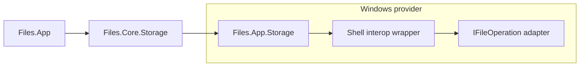
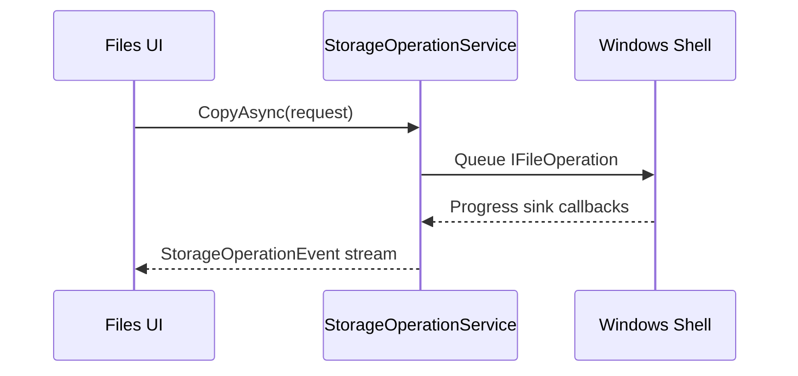
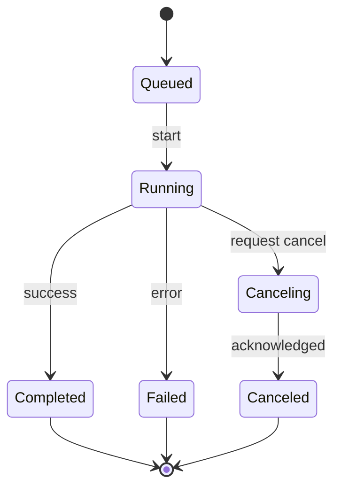
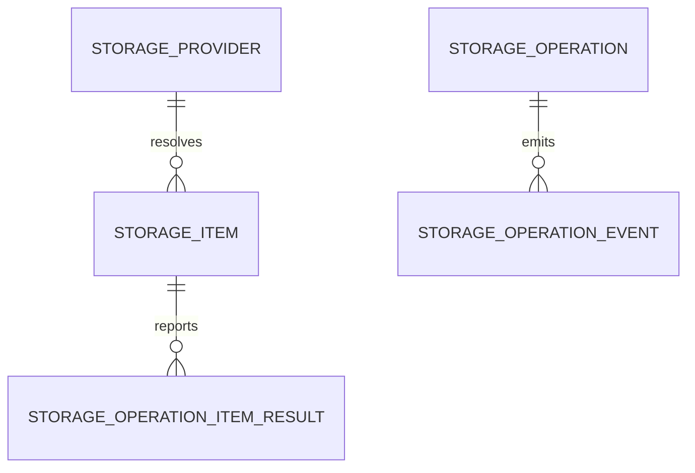
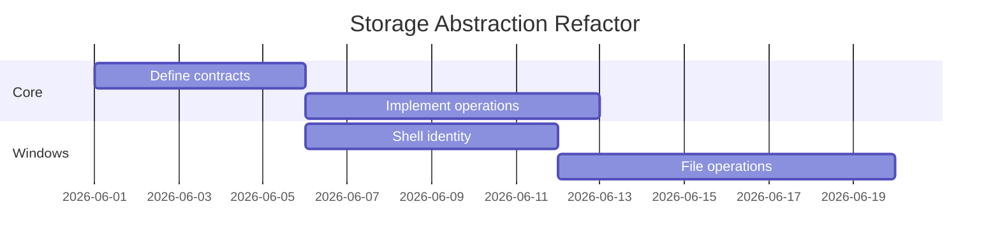

# Mermaid Diagrams

Use this skill when creating or editing Mermaid diagrams for repository files,
especially Markdown documentation and specs. Prefer GitHub-friendly Mermaid that
is readable in source form and useful even before rendering.

## Workflow

1. Ground the diagram in real context. Read the relevant code, docs, issues, or
   user-provided notes before inventing nodes or edges.
2. Pick one diagram type that matches the question. Split large subjects into
   multiple small diagrams instead of making one dense chart.
3. Write a fenced Markdown block:

   ````markdown
   ```mermaid
   flowchart LR
       A["Input"] --> B["Process"]
   ```
   ````

4. Keep node ids short ASCII identifiers. Put human-readable text in quoted
   labels.
5. Review the source as text: a maintainer should understand the diagram from
   the Mermaid block without needing rendered output.
6. Validate syntax when practical, but do not add project dependencies only to
   render Mermaid.

## Diagram Selection

| Need | Use |
| --- | --- |
| Architecture, ownership boundaries, data/control flow | `flowchart LR` or `flowchart TD` |
| Step-by-step calls between actors over time | `sequenceDiagram` |
| Object lifecycle, operation status, UI mode transitions | `stateDiagram-v2` |
| Tables, entities, keys, relationships | `erDiagram` |
| Schedule, phased plan, milestones | `gantt` |
| Simple proportions | `pie` |
| Code type relationships | `classDiagram`, but keep it small |

Avoid unsupported or fragile Mermaid features unless the target renderer is
known. For GitHub docs, prefer common Mermaid syntax and avoid custom theme
initialization, HTML-heavy labels, external images, and renderer-specific hacks.

## Flowchart Rules

- Prefer `flowchart LR` for layered architecture and dependency direction.
- Prefer `flowchart TD` for pipelines, workflows, and decision trees.
- Use `subgraph` for ownership boundaries such as projects, processes, layers,
  or providers.
- Label edges when the relationship is not obvious.
- Do not overuse styling. If emphasis is needed, use one or two `classDef`
  styles at most.

Example:



## Sequence Rules

- Use participants with real component names.
- Keep messages short and action-oriented.
- Use `alt`, `opt`, and `loop` only when they clarify behavior.
- Avoid long notes. Put details in surrounding Markdown instead.

Example:



## State Rules

- Use state diagrams for lifecycles and cancellation/completion behavior.
- Make terminal states explicit.
- Label transitions with events or commands.

Example:



## ERD Rules

- Use ERDs only for durable data models, not temporary object graphs.
- Use domain names rather than implementation noise.
- Put cardinality on the relationship, not in prose-only labels.

Example:



## Gantt Rules

- Use ISO dates when dates matter.
- Use relative durations only when making an illustrative plan.
- Keep tasks high-level; detailed task lists belong in Markdown.

Example:



## GitHub-Friendly Guardrails

- Quote labels that contain spaces, punctuation, generics, parentheses, `&`,
  `:`, `/`, or `.`.
- Keep ids ASCII and stable: `CoreStorage`, `WindowsProvider`, `OperationSink`.
- Avoid semicolons unless needed by the diagram type.
- Avoid deeply nested subgraphs.
- Avoid layout micromanagement; if layout needs too much force, split the
  diagram.
- Do not include secrets, local-only paths, or generated-file details unless the
  docs explicitly need them.

## Review Checklist

- Does the diagram answer one clear question?
- Are all nodes real concepts from the codebase or user request?
- Are arrows directionally meaningful?
- Would the diagram still make sense if rendered styling is ignored?
- Is surrounding Markdown carrying the explanation instead of overloading node
  labels?
- Is the diagram small enough to maintain?
