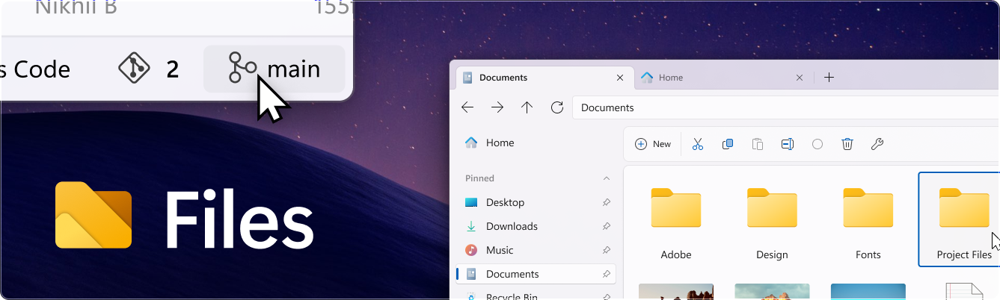
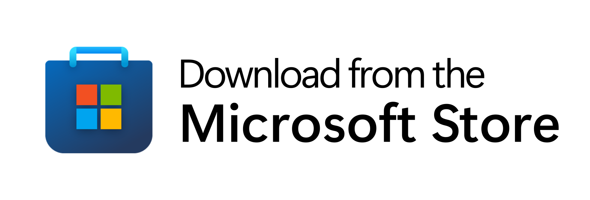
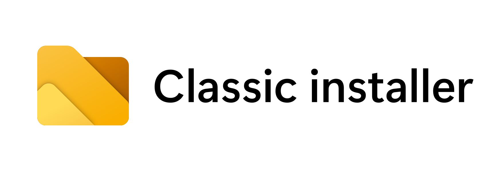
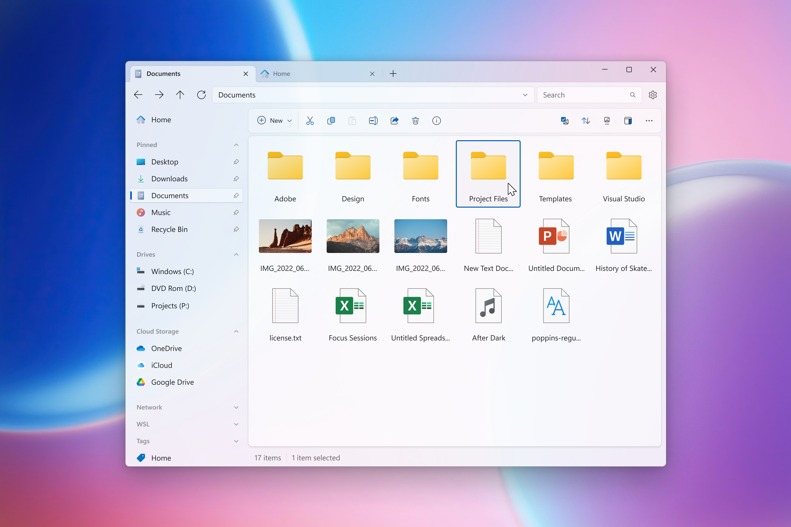

<p align="center">
  
</p>

<p align="center">
  <a style="text-decoration:none" href="https://files.community/">
    </a>
  <a style="text-decoration:none" href="https://github.com/files-community/Files/actions/workflows/ci.yml">
    </a>
  <a style="text-decoration:none" href="https://crowdin.com/project/files-app">
    </a>
  <a style="text-decoration:none" href="https://discord.gg/files">
    </a>
</p>

Files is a modern file manager that helps users organize their files and folders. Our mission with Files is to build the best file manager for Windows, and we’re proud to be building it out in the open so everyone can participate. User feedback helps shape the features we work on, & the bug reports on GitHub help to make Files more reliable. Built and maintained by the open-source community, Files features robust multitasking experiences, file tags, deep integrations, and an intuitive design.

## Installing and running Files

Files is a community-driven project that depends on your support to grow and improve. Please consider purchasing Files through the Microsoft Store or supporting us on GitHub if you use the classic installer.

You can also use the preview version alongside the stable release to get early access to new features and improvements.

<p align="left">
  <!-- Store Badge -->
  <a style="text-decoration:none" href="https://apps.microsoft.com/detail/9NGHP3DX8HDX?launch=true&mode=full">
    <picture>
      <source media="(prefers-color-scheme: light)" srcset="../assets/StoreBadge-dark.png" width="220" />
      
  </picture></a>
  &ensp;
  <!-- Classic Installer Badge -->
  <a style="text-decoration:none" href="https://cdn.files.community/files/download/Files.Stable.exe">
    <picture>
      <source media="(prefers-color-scheme: light)" srcset="../assets/ClassicInstallerBadge-dark.png" width="220" />
      
    </picture></a>
</p>

## Building from source
  
#### 1. Prerequisites

- [Visual Studio 2022](https://visualstudio.microsoft.com/vs/) with the following individual components:
    - Windows 11 SDK (10.0.22621.0)
    - .NET 8 SDK
    - MSVC v143 - VS 2022 C++ x64/x86 or ARM64 build tools (latest)
    - C++ ATL for latest v143 build tools (x86 & x64 or ARM64)
    - Git for Windows
- [Windows App SDK 1.5](https://learn.microsoft.com/windows/apps/windows-app-sdk/downloads#current-releases)
    
#### 2. Clone the repository

```ps
git clone https://github.com/files-community/Files
```

This will create a local copy of the repository.

#### 3. Build the project

To build Files for development, open the `Files.sln` item in Visual Studio. Right-click on the `Files.Package` packaging project in solution explorer and select ‘Set as Startup item’.

In the top pane, select the items which correspond to your desired build mode and the processor architecture of your device like below:

  
## Contributing to Files

Want to contribute to this project? Let us know with an [issue](https://github.com/files-community/Files/issues) that communicates your intent to create a [pull request](https://github.com/files-community/Files/pulls). Also, view our [contributing guidelines](https://github.com/files-community/Files/blob/main/.github/CONTRIBUTING.md) to make sure you're up to date on the coding conventions.

Looking for a place to start? Check out the [task board](https://github.com/orgs/files-community/projects/3/views/2), where you can sort tasks by size and priority.

## Screenshots


