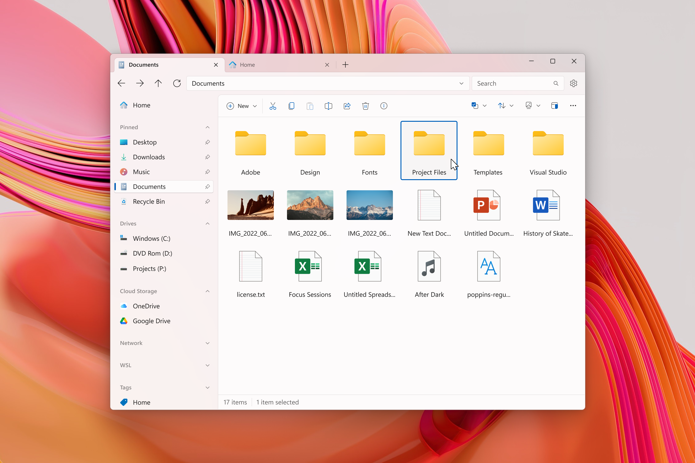

  
  <h1 align="center">Files</h1>

    
    
    
    
    

Introducing Files, the ultimate file manager app for Windows. With its sleek and intuitive design, navigating through your files has never been easier. Files features tabs for easy switching between different folders, a column view for quick file browsing, and dual pane support for efficient file management. In addition, you can easily create and extract archives with just a few clicks, making file compression and decompression a breeze.

Files also offers advanced features such as file tagging for easy organization, support for QuickLook for previewing files without opening them, and the ability to customize the background color to match your personal style. Whether you're a power user or just looking for a better way to manage your files, Files has everything you need to keep your files organized and easily accessible. With its combination of powerful features and ease of use, Files is the ultimate file management solution for Windows.

## Installing Files

### Via Microsoft Store

This way enables you to always use the latest stable version of the app and recieve updates when we release a stable update

### Via our website

If you have an installation issue with the Store, you can download the app through [our website](https://files.community/download).

### Running from the source

Visit [our documentation](https://files.community/docs/contributing/building-from-source) to meet the requirements.

## Contributing

This project is a community-driven and built on all your contributions.
We're excited work together to boost Files, the best file manager for Windows.

Before working on [a feature or bug fix](https://github.com/files-community/Files/issues), please read [our contribution guidelines](https://github.com/files-community/Files/blob/main/.github/CONTRIBUTING.md) to avoid any chance of your work being wasted. If you're looking for a place to start, check out [our task board](https://github.com/orgs/files-community/projects/3/views/2), where you can sort tasks by priority, status and size.

## Translating

We also welcome your contribution of translating the app on [Crowdin](https://crowdin.com/project/files-app), where you can discuss translation issues and focus on your favorite languages as well.

## Screenshots

