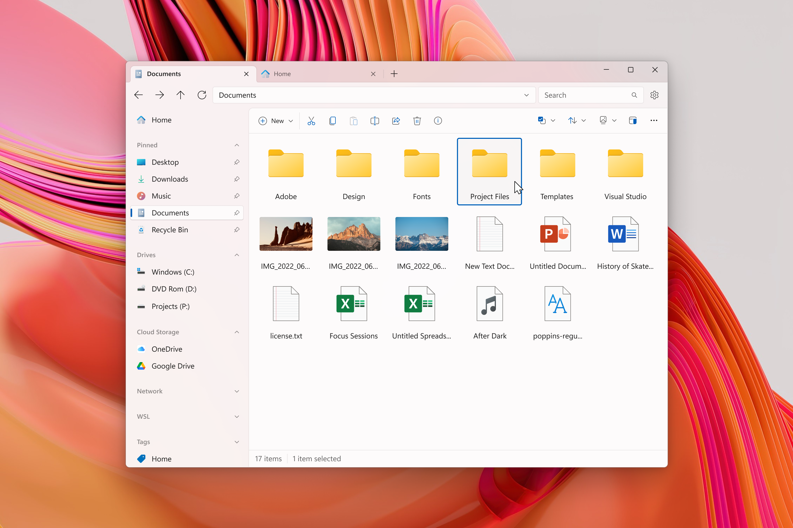

  <h1 align="center"> Files</h1>

Introducing Files, the ultimate file manager app for Windows. With its sleek and intuitive design, navigating through your files has never been easier. Files features tabs for easy switching between different folders, a column view for quick file browsing, and dual pane support for efficient file management. In addition, you can easily create and extract archives with just a few clicks, making file compression and decompression a breeze.

Files also offers advanced features such as file tagging for easy organization, support for QuickLook for previewing files without opening them, and the ability to customize the background color to match your personal style. Whether you're a power user or just looking for a better way to manage your files, Files has everything you need to keep your files organized and easily accessible. With its combination of powerful features and ease of use, Files is the ultimate file management solution for Windows.

## Installing and running Files

### Via Microsoft Store

This method enables you to support developers and be up to date by automatically updating through the Store.

### Via our installer

If you unable to install though the Store for some reasons, this method enables you to install directly from our website with automatic update for stable version enabled.

[Install from our website](https://files.community/download)

### Building from the source

- [Visual Studio 2022](https://visualstudio.microsoft.com/vs/) with the following individual components:
    - Windows 11 SDK (10.0.22621.0)
    - .NET 7 SDK
    - MSVC v143 - VS 2022 C++ x64/x86 or ARM64 build tools (latest)
    - C++ ATL for latest v143 build tools (x86 & x64 or ARM64)
    - Git for Windows
- [Windows App SDK 1.4](https://learn.microsoft.com/windows/apps/windows-app-sdk/downloads#current-releases)

To build the project, see [the build instruction](https://files.community/docs/contributing/building-from-source) 

## Contributing

The project is open source and is built on contributions from the community. The community welcomes contribution in any type, including bug reports, new features, localization, docs, designs, feedback, and donations.

Please read our [Contribution Guidelines](CONTRIBUTING.md) and [Code of Conduct](CODE_OF_CONDUCT.md) before starting to contribute on [filing an issue](https://github.com/files-community/Files/issues) to submit bug report, request a new feature and so on.

If you are looking for a place to start check [our Files project task board](https://github.com/orgs/files-community/projects/3/views/2), where you can sort tasks by size and priority.

If you would like to work on improving localization of the Files app, visit [Crowdin](https://crowdin.com/project/files-app), where holds our all localization resourcecs appear on the app.

Join [our Discord](https://discord.gg/files) to give us your feedback and keep you posted.

## Screenshots

