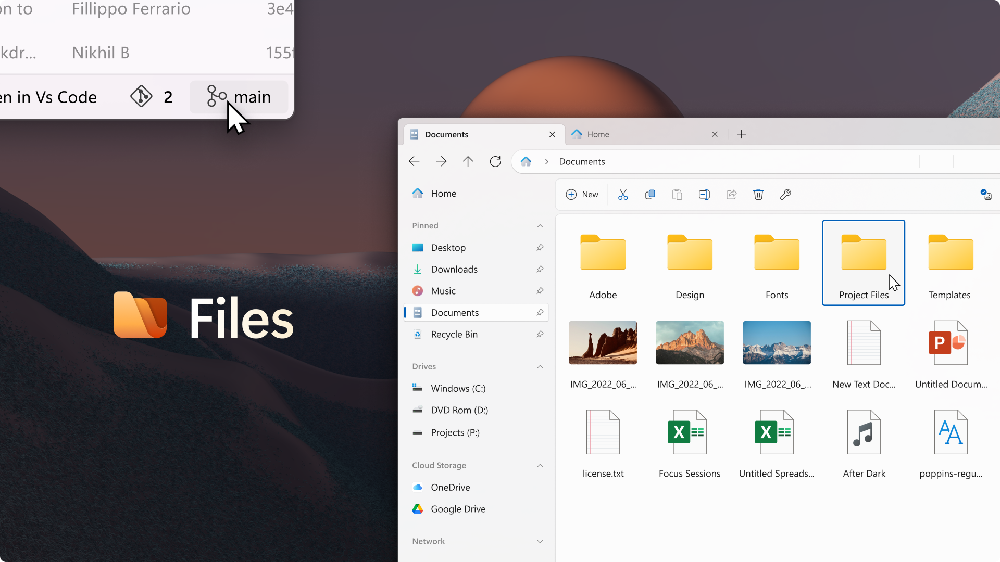

# Files

  

  
  
  
  

## 🚀 Introduction

Files is a modern, open-source file manager designed to enhance the way you organize and interact with your files and folders on Windows. Our mission is to create the best file management experience possible, and we're doing it with the help of our passionate community.

### Key Features

- 📂 Intuitive and modern design
- 🏷️ File tagging system
- 🔄 Robust multitasking capabilities
- 🔗 Deep system integrations
- 🌐 Community-driven development

## 📥 Installation

Files is available through multiple channels to suit your preferences:

  
  &nbsp;&nbsp;
  

> 💡 **Tip:** You can install the preview version alongside the stable release to get early access to new features and improvements.

## 🛠️ Building from Source

For developers interested in building Files from source, detailed instructions can be found in our [documentation](https://files.community/docs/contributing/building-from-source).

## 🤝 Contributing

We welcome contributions from developers of all skill levels! Here's how you can get involved:

1. Check out our [issue tracker](https://github.com/files-community/Files/issues) for open tasks.
2. Review our [contributing guidelines](https://github.com/files-community/Files/blob/main/.github/CONTRIBUTING.md).
3. Fork the repository and create a pull request with your changes.

Not sure where to start? Take a look at our [task board](https://github.com/orgs/files-community/projects/3/views/2), where you can filter tasks by size and priority.

## 📸 Screenshots

  

## 💖 Support the Project

Files is a community-driven project that relies on your support to grow and improve. If you find Files useful, please consider:

- Purchasing it through the Microsoft Store
- Supporting us on GitHub
- Spreading the word about Files

Your support helps ensure the continued development and improvement of this open-source file manager.

## 🌐 Connect with Us

- [Website](https://files.community/)
- [Discord](https://discord.gg/files)
- [GitHub](https://github.com/files-community/Files)

---

Thank you for your interest in Files! Together, we're building the future of file management on Windows.
