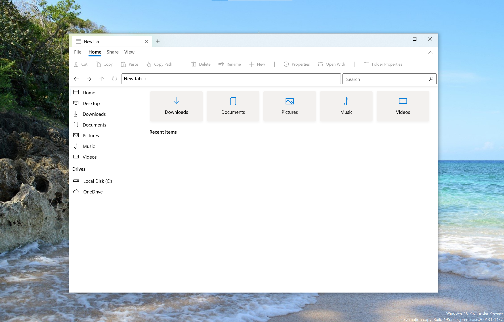

  

## Welcome to the Files repository

## What is Files?
Files is a file manager for Windows with a powerful yet intuitive design. It has features like multiple tabs, panes, columns, shell extensions in the context menu and tags.

## Where to get Files
- [Microsoft Store](https://www.microsoft.com/store/apps/9NGHP3DX8HDX)

## Vision for Files
Our vision for Files is to be fully functional while keeping it simple and easy to use. Whether it's implementing new features, or pushing the boundaries of the platform, your input will help shape the future of Files.

## Why should I contribute?
We can confidently assert Files is the platform's best file explorer project to bring your innovations to. We focus heavily on extensibility and code modularity and have no plans to stop doing so. When you contribute to this project, you're helping everyone by fixing reported bugs, adding new features, or correcting existing behavior. These changes are quickly included in the final product for all users to benefit from.

We welcome discussions and contributions to our repository, however to help maintain a healthy community, please read our [code of conduct](https://github.com/files-community/Files/blob/main/CODE_OF_CONDUCT.md).

## Building Files source
- Install Visual Studio 2019 and the UWP Development Kit.
- Clone the repository and open the `Files.sln` in VS.
- Visual Studio will install all missing dependencies.
- Run the `Files.Package` project.

View our [Contributing guidelines](https://github.com/files-community/Files/blob/main/.github/CONTRIBUTING.md)

## FAQ
Have any questions? Check out our [documentation site](https://files.community/docs)!
