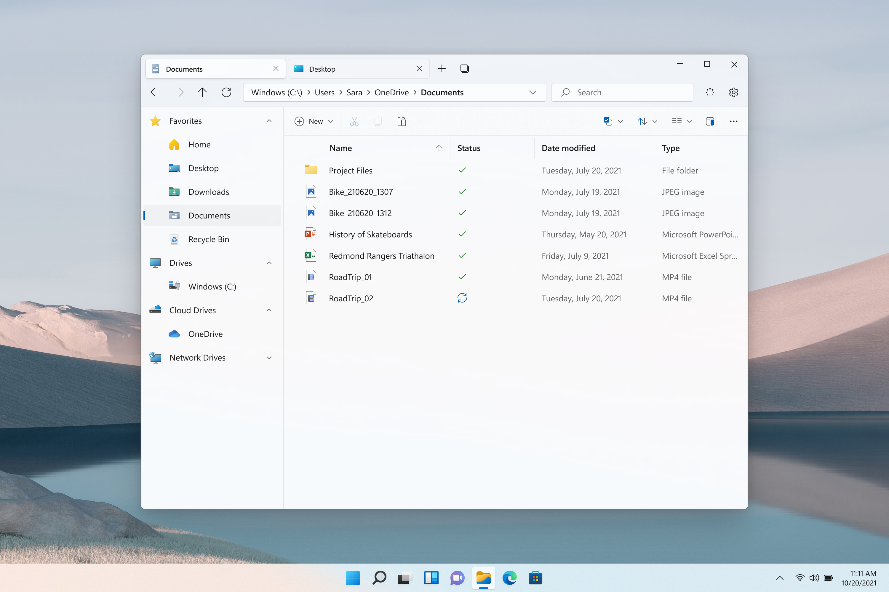

<p align="center">
  
  <h1 align="center">Files</h1>
</p>

[](https://dev.azure.com/filescommunity/Files/_build/latest?definitionId=4&branchName=main)
[](https://crowdin.com/project/files-app)
[](https://discord.gg/files)
<a style="text-decoration:none" href="https://www.microsoft.com/store/apps/9NGHP3DX8HDX">
    
</a>
<a style="text-decoration:none" href="https://files.community/download/stable">
    
</a>
<a style="text-decoration:none" href="https://files.community/download/preview">
    
</a>

## What is Files?
Files is a file manager for Windows with a powerful yet intuitive design. It has features like multiple tabs, panes, columns, shell extensions in the context menu and tags.

We welcome discussions and contributions to our repository, however to help maintain a healthy community, please read our [code of conduct](https://github.com/files-community/Files/blob/main/CODE_OF_CONDUCT.md).

## Privacy
We use App Center to track which settings are being used, find bugs, and fix crashes. Information sent to App Center is anonymous and free of any user or contextual data.

## FAQ
Have any questions? Check out our [documentation site](https://files.community/docs)!

## Building from source

### 1: Prerequisites

- [Git](https://git-scm.com)
- [Visual Studio 2022](https://visualstudio.microsoft.com/vs/) with the UWP Development Kit and following individual components:
    - Windows 11 SDK (10.0.22000)
    - MSVC v143 - VS 2022 C++ x64/x86 build tools
    - C++ ATL for latest v143 build tools (x86 & x64)

### 2: Clone the repository.

```ps
git clone https://github.com/files-community/Files
```

This will create a local copy of the repository.

### 3: Build the project

To build the app in development mode, open the sln file in Visual Studio (Files.sln) and set the Files.Package project as the startup item by right-clicking on `Files.Package` in the solution explorer & hitting ‘Set as Startup item’.

In the architecture pane, select the correct architecture for your system as Debug which should look like this:


## Contributors

Want to contribute to this project? Feel free to open an [issue](https://github.com/files-community/Files/issues) or [pull request](https://github.com/files-community/Files/pulls). View our [Contributing guidelines](https://github.com/files-community/Files/blob/main/.github/CONTRIBUTING.md) to make sure you're up to date on the latest guidelines for contributing to the Files codebase.

## Screenshots


