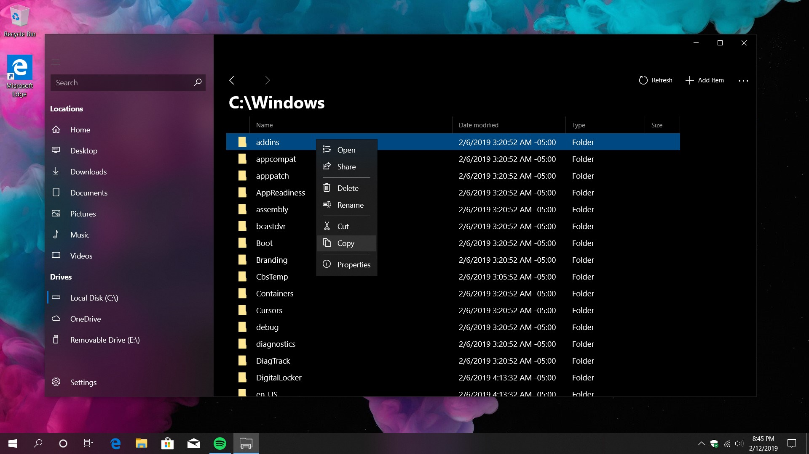

<h1>Files UWP</h1>
<h3>Meet Files, a brand-new file manager for Windows 10.</h3>

Created from the ground up to look and feel amazing, Files is built to replace the outdated Windows File Explorer.

<a href="https://youtu.be/1wSA8PYKhpA?t=124">Link to old sideloading help video</a>

