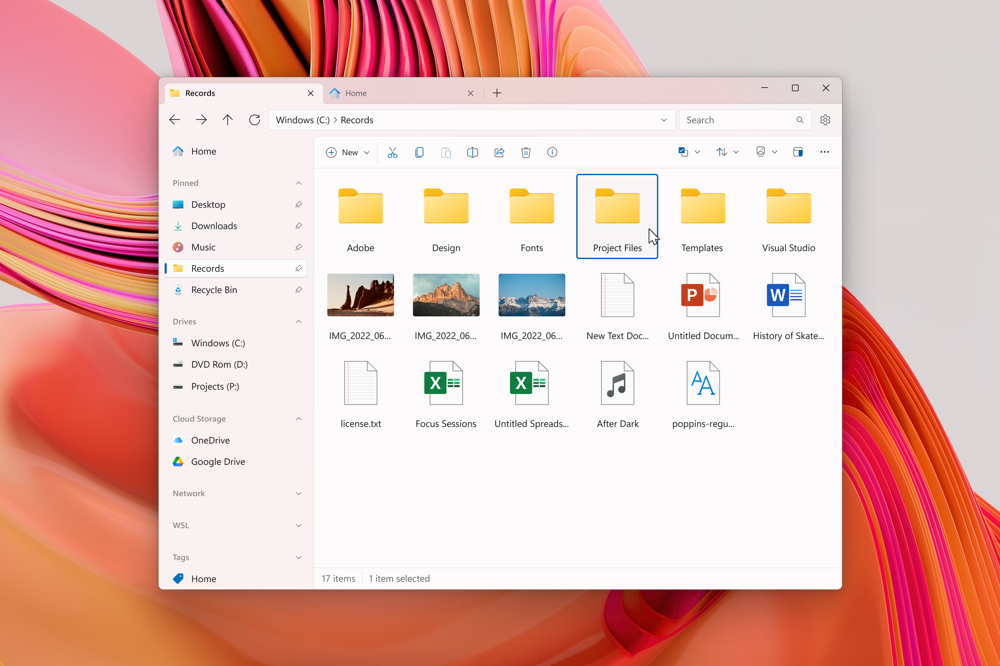

<p align="center">
  
  <h1 align="center">Files</h1>
</p>

[](https://dev.azure.com/filescommunity/Files/_build/latest?definitionId=4&branchName=main)
[](https://crowdin.com/project/files-app)
[](https://discord.gg/files)
<a style="text-decoration:none" href="https://files.community/download">
    
</a>
<a style="text-decoration:none" href="https://files.community/docs">
    
</a>

Introducing Files, the ultimate file manager app for Windows. With its sleek and intuitive design, navigating through your files has never been easier. Files features tabs for easy switching between different folders, a column view for quick file browsing, and dual pane support for efficient file management. In addition, you can easily create and extract archives with just a few clicks, making file compression and decompression a breeze.

Files also offers advanced features such as file tagging for easy organization, support for QuickLook for previewing files without opening them, and the ability to customize the background color to match your personal style. Whether you're a power user or just looking for a better way to manage your files, Files has everything you need to keep your files organized and easily accessible. With its combination of powerful features and ease of use, Files is the ultimate file management solution for Windows.

## Building from source

### 1. Prerequisites

- [Visual Studio 2022](https://visualstudio.microsoft.com/vs/) with the following individual components:
    - Windows 11 SDK (10.0.22621.0)
    - .NET 7 SDK
    - MSVC v143 - VS 2022 C++ x64/x86 or ARM64 build tools (latest)
    - C++ ATL for latest v143 build tools (x86 & x64 or ARM64)
    - Git for Windows
- [Windows App SDK 1.3](https://learn.microsoft.com/windows/apps/windows-app-sdk/downloads#current-releases)
    
### 2. Clone the repository

```ps
git clone https://github.com/files-community/Files
```

This will create a local copy of the repository.

### 3. Build the project

To build Files for development, open the `Files.sln` item in Visual Studio. Right-click on the `Files.Package` packaging project in solution explorer and select ‘Set as Startup item’.

In the top pane, select the items which correspond to your desired build mode and the processor architecture of your device like below:


## Contributors

Want to contribute to this project? Let us know with an [issue](https://github.com/files-community/Files/issues) that communicates your intent to create a [pull request](https://github.com/files-community/Files/pulls). Also, view our [contributing guidelines](https://github.com/files-community/Files/blob/main/.github/CONTRIBUTING.md) to make sure you're up to date on the coding conventions.

Looking for a place to start? Check out the [task board](https://github.com/orgs/files-community/projects/3/views/2), where you can sort tasks by size and priority.

## Screenshots


