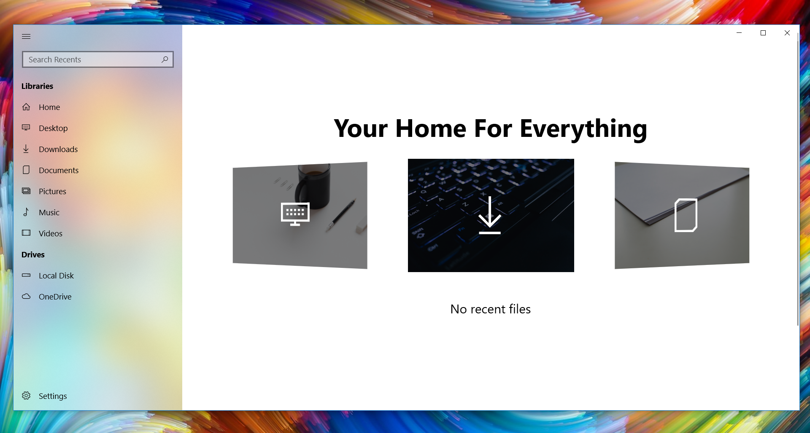
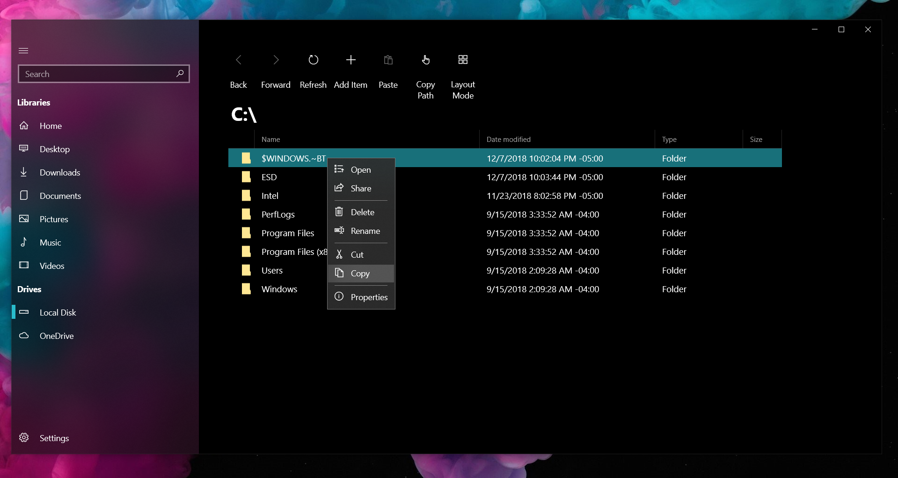
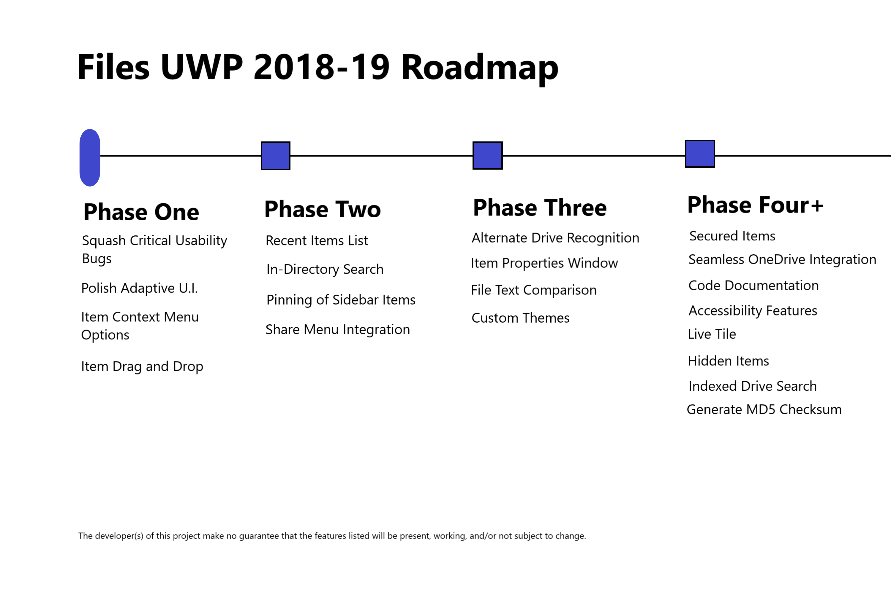

<h1>Files for Windows 10</h1>
<h3>Meet Files, a brand-new File Manager for Windows 10.</h3>

Created from the ground up to look and feel amazing, Files is built to replace the outdated Windows File Explorer.

 
<h3>Download Files</h3>

Files will eventually be available in the Microsoft Store (Hopefully by Winter 2018), or you can <a href="https://drive.google.com/drive/folders/1cXCNPNoJWLj59lBV0SPxb5x3HYjphOFy?usp=sharing">download</a> a precompiled sideload package. Please note: these builds are unstable, incomplete, and only work on the latest <b>April Update 1803</b>.
 
 

