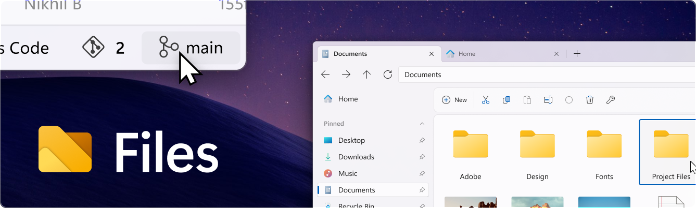
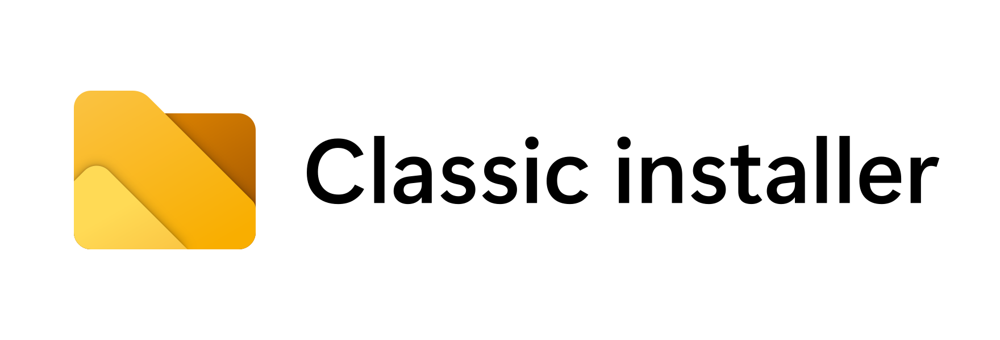
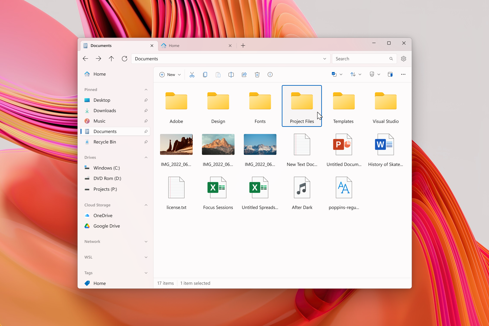

  

  
  
  
  

Files is a modern file manager that helps users organize their files and folders. Our mission with Files is to build the best file manager for Windows, and we’re proud to be building it out in the open so everyone can participate. User feedback helps shape the features we work on, & the bug reports on GitHub help to make Files more reliable. Built and maintained by the open-source community, Files features robust multitasking experiences, file tags, deep integrations, and an intuitive design.

## Installing and running Files

Files is a community-driven project that depends on your support to grow and improve. Please consider purchasing Files through the Microsoft Store or supporting us on GitHub if you use the classic installer.

You can also use the preview version alongside the stable release to get early access to new features and improvements.

  <!-- Store Badge -->
  <a style="text-decoration:none" href="https://apps.microsoft.com/detail/9NGHP3DX8HDX?launch=true&mode=full">
    <picture>
      <source media="(prefers-color-scheme: light)" srcset="./assets/StoreBadge-dark.png" height="80" />
      </picture></a>
  &ensp;
  <!-- Classic Installer Badge -->
  <a style="text-decoration:none" href="https://files.community/download">
    <picture>
      <source media="(prefers-color-scheme: light)" srcset="./assets/ClassicInstallerBadge-dark.png" height="80" />
      </picture></a>

## Building from source

Instructions for building the source code can be found on our [documentation site](https://files.community/docs/contributing/building-from-source).

## Contributing to Files

Want to contribute to this project? Let us know with an [issue](https://github.com/files-community/Files/issues) that communicates your intent to create a [pull request](https://github.com/files-community/Files/pulls). Also, view our [contributing guidelines](https://github.com/files-community/Files/blob/main/.github/CONTRIBUTING.md) to make sure you're up to date on the coding conventions.

Looking for a place to start? Check out the [task board](https://github.com/orgs/files-community/projects/3/views/2), where you can sort tasks by size and priority.

## Screenshots

## 🌐 Web Resources & Interactive Index
- [CATEGORY DRESS UP](https://iskillquest.pages.dev/category-dress-up.html)
- [GOING BALLS ADVENTURE 2](https://iskillcrafts.pages.dev/going-balls-adventure-2.html)
- [MAGIC SORT](https://iskillquest.pages.dev/magic-sort.html)
- [CATEGORY BRAIN](https://themindplaying.web.app/category-brain.html)
- [PHRASLE MASTER](https://themindplay.pages.dev/phrasle-master.html)
- [AIM NINJA](https://thelearnquesters.pages.dev/aim-ninja.html)
- [MONSTER MERGE LEGENDS ALIVE](https://iskillquest.pages.dev/monster-merge-legends-alive.html)
- [OBBY 1 PET EVERY SECONDS](https://themindplay.pages.dev/obby-1-pet-every-seconds.html)
- [ROBLOX HALLOWEEN COSTUME PARTY](https://themindplay.pages.dev/roblox-halloween-costume-party.html)
- [KNIT BEARS](https://iskillquest.pages.dev/knit-bears.html)
- [MISSILE LAUNCH MASTER](https://themindzone.pages.dev/missile-launch-master.html)
- [WORLD SOLITAIRE TRIPEAKS ](https://iskillquest.pages.dev/world-solitaire-tripeaks-.html)
- [DRIFT DONUT](https://themindzone.pages.dev/drift-donut.html)
- [IDOL LIVESTREAM DOLL DRESS UP](https://themindplay.pages.dev/idol-livestream-doll-dress-up.html)
- [HEIST DEFENDER](https://themindzone.pages.dev/heist-defender.html)
- [CATEGORY MATCH 3117](https://themindplay.github.io/category-match-3117.html)
- [ARROW SLIDE PUZZLE](https://iskillquest.pages.dev/arrow-slide-puzzle.html)
- [ANIMAL TRANSFORM RACE](https://iskillquest.pages.dev/animal-transform-race.html)
- [KITTY MATCH 3 PUZZLE GAME](https://iskillquest.pages.dev/kitty-match-3-puzzle-game.html)
- [FIREBOY WATERGIRL 7 AND FRIENDS](https://thequizzone.pages.dev/fireboy-watergirl-7-and-friends.html)
- [KOBOLM RESCUE](https://thequizzone.pages.dev/kobolm-rescue.html)
- [TERMS](https://thcskq.github.io/terms.html)
- [DINO IDLE PARK](https://themindplay.pages.dev/dino-idle-park.html)
- [SPACE BLAST](https://iskillquest.pages.dev/space-blast.html)
- [OBBY POGO PARKOUR](https://iskillquest.pages.dev/obby-pogo-parkour.html)
- [CIRCUIT MASTER](https://thequizzone.pages.dev/circuit-master.html)
- [CATEGORY POOL17](https://thequizzone.pages.dev/category-pool17.html)
- [CATEGORY MMO25](https://thequizzone.pages.dev/category-mmo25.html)
- [GIFT MERGE SANTA WORLD TOUR](https://themindzone.pages.dev/gift-merge-santa-world-tour.html)
- [CLEANING PRINCESS](https://themindplay.pages.dev/cleaning-princess.html)
- [CATEGORY MOBILE2 095](https://thequizzone.pages.dev/category-mobile2-095.html)
- [TIMEWARRIORS](https://iskillquest.pages.dev/timewarriors.html)
- [CATEGORY MINECRAFT 2](https://thequizzone.pages.dev/category-minecraft-2.html)
- [HOME MATCH TILE MASTER](https://themindzone.pages.dev/home-match-tile-master.html)
- [BFFS CHERRY BLOSSOM CELEBRATION](https://themindzone.pages.dev/bffs-cherry-blossom-celebration.html)
- [SPACE SURVIVAL RAINBOW FRIENDS MONSTER](https://iskillquest.pages.dev/space-survival-rainbow-friends-monster.html)
- [CATEGORY THINKY](https://themindplay.pages.dev/category-thinky.html)
- [BACK 2 SCHOOL MAKEOVER](https://themindplay.pages.dev/back-2-school-makeover.html)
- [MAZE ESCAPE CRAFT MAN](https://themindzone.pages.dev/maze-escape-craft-man.html)
- [SORTSTORE](https://iskillquest.pages.dev/sortstore.html)
- [CATEGORY UNBLOCKED WEBSITES](https://themindplay.pages.dev/category-unblocked-websites.html)
- [COLOR WATER PUZZLE](https://themindzone.pages.dev/color-water-puzzle.html)
- [RED STICKMAN VS MONSTER SCHOOL](https://iskillquest.pages.dev/red-stickman-vs-monster-school.html)
- [OFFROAD CRASH CLIMBER 4X4](https://thequizzone.pages.dev/offroad-crash-climber-4x4.html)
- [INDEX7](https://theskillquest.pages.dev/index7.html)
- [WEDNESDAY ADDAMS BEAUTY SALON](https://thequizzone.pages.dev/wednesday-addams-beauty-salon.html)
- [IDLE LANDMARK BUILDER](https://themindplay.pages.dev/idle-landmark-builder.html)
- [CATEGORY MATCH 3](https://thequizzone.pages.dev/category-match-3.html)
- [BUBBLE SHOOTER NEON](https://themindplay.pages.dev/bubble-shooter-neon.html)
- [RAGDOLL PARKOUR SIMULATOR](https://themindplay.github.io/ragdoll-parkour-simulator.html)
- [KNIFE MADNESS](https://themindplay.pages.dev/knife-madness.html)
- [SWORD AND JEWEL](https://iskillquest.pages.dev/sword-and-jewel.html)
- [KINGS AND QUEENS MATCH 2](https://thequizzone.pages.dev/kings-and-queens-match-2.html)
- [HARVESTING VEGGIES](https://themindzone.pages.dev/harvesting-veggies.html)
- [SAVE THE PIGGIES](https://themindplay.pages.dev/save-the-piggies.html)
- [WAFFLE WORDS](https://thequizzone.pages.dev/waffle-words.html)
- [CATEGORY PIXEL313](https://thequizzone.pages.dev/category-pixel313.html)
- [CAT VS GRANNY CAT SIMULATOR](https://iskillquest.pages.dev/cat-vs-granny-cat-simulator.html)
- [CATEGORY MATCH 3 2](https://theskillquest.pages.dev/category-match-3-2.html)
- [CATEGORY MOBILE2 112 2](https://thequizzone.pages.dev/category-mobile2-112-2.html)
- [CHROMA TREK](https://thequizzone.pages.dev/chroma-trek.html)
- [FOOD TRUCK CHEF COOKING](https://iskillquest.pages.dev/food-truck-chef-cooking.html)
- [CATEGORY STICKMAN 2](https://thequizzone.pages.dev/category-stickman-2.html)
- [INDEX34](https://theskillquest.pages.dev/index34.html)
- [BARK BLAST](https://thequizzone.pages.dev/bark-blast.html)
- [GRAND MAHJONG CONNECT](https://thequizzone.pages.dev/grand-mahjong-connect.html)
- [TAP HOLD](https://iskillquest.pages.dev/tap-hold.html)
- [BUNNY BLOX](https://themindplay.pages.dev/bunny-blox.html)
- [CONSTRUCTION SET 3D BUILDER](https://thequizzone.pages.dev/construction-set-3d-builder.html)
- [LABUBA HALLOWEEN INFESTATION](https://themindplay.github.io/labuba-halloween-infestation.html)
- [RAGDOLL BEAT SIMULATOR](https://iskillquest.pages.dev/ragdoll-beat-simulator.html)
- [CATEGORY UNBLOCKED GAMES](https://thequizzone.pages.dev/category-unblocked-games.html)
- [CATEGORY DRAGON](https://themindplay.pages.dev/category-dragon.html)
- [CATEGORY LUNAAR](https://theskillquest.pages.dev/category-lunaar.html)
- [INDEX32](https://themindzone.pages.dev/index32.html)
- [ROBBIE BECOME A BEAST](https://iskillquest.pages.dev/robbie-become-a-beast.html)
- [GEOMETRY WAVE HERO](https://iskillquest.pages.dev/geometry-wave-hero.html)
- [BANANA BOUNCE](https://themindzone.pages.dev/banana-bounce.html)
- [CAMERAMAN VS TOILETS PUZZLE](https://themindzone.pages.dev/cameraman-vs-toilets-puzzle.html)
- [CATEGORY STICKMAN 3](https://thequizzone.pages.dev/category-stickman-3.html)
- [HERITAGE MAHJONG CLASSIC](https://themindplay.pages.dev/heritage-mahjong-classic.html)
- [CATEGORY SURVIVAL366](https://themindplay.pages.dev/category-survival366.html)
- [ZEN SOLITAIRE](https://themindplay.github.io/zen-solitaire.html)
- [INDEX27](https://themindplay.pages.dev/index27.html)
- [CATEGORY SURVIVAL](https://themindplay.pages.dev/category-survival.html)
- [CATEGORY CAR 2](https://themindplay.github.io/category-car-2.html)
- [TRAFFIC RUN PUZZLE](https://thequizzone.pages.dev/traffic-run-puzzle.html)
- [MINETAP](https://themindplay.pages.dev/minetap.html)
- [INDEX2](https://themindzone.pages.dev/index2.html)
- [UPHILL RUSH 13](https://themindplay.pages.dev/uphill-rush-13.html)
- [CATEGORY 2D1 070](https://iskillquest.pages.dev/category-2d1-070.html)
- [SQUID CHALLENGE PLAY TO SURVIVE](https://iskillquest.pages.dev/squid-challenge-play-to-survive.html)
- [MY DOGY VIRTUAL PET](https://thequizzone.pages.dev/my-dogy-virtual-pet.html)
- [CATEGORY SPEED158](https://themindplay.pages.dev/category-speed158.html)
- [CATEGORY CASUAL 5](https://theskillquest.pages.dev/category-casual-5.html)
- [CATEGORY FREE RAGDOLL GAMES](https://theskillquest.pages.dev/category-free-ragdoll-games.html)
- [BACKYARD DIG HOLE 3D SIMULATOR](https://theskillquest.pages.dev/backyard-dig-hole-3d-simulator.html)
- [DESTRUCTION OF STICKMAN ZOMBIE](https://theskillquest.pages.dev/destruction-of-stickman-zombie.html)
- [INDEX14](https://themindzone.pages.dev/index14.html)
- [SPACE SHOOTER SPEED TYPING CHALLENGE](https://themindplay.pages.dev/space-shooter-speed-typing-challenge.html)
- [MINEBLOCK OBBY](https://iskillquest.pages.dev/mineblock-obby.html)
- [SOCCER SNAKES](https://thequizzone.pages.dev/soccer-snakes.html)
- [CATEGORY PLATFORM260](https://thequizzone.pages.dev/category-platform260.html)
- [LAZY WORKERS](https://thequizzone.pages.dev/lazy-workers.html)
- [RESIDENT EVIL PURGE OPERATION](https://thequizzone.pages.dev/resident-evil-purge-operation.html)
- [INDEX42](https://iskillquest.pages.dev/index42.html)
- [CATEGORY STRATEGY 2](https://thequizzone.pages.dev/category-strategy-2.html)
- [SPORTSBALL MERGE](https://themindplay.pages.dev/sportsball-merge.html)
- [BELL MADNESS](https://themindplay.pages.dev/bell-madness.html)
- [OVERPROTECTIVE BOYFRIEND](https://themindzone.pages.dev/overprotective-boyfriend.html)
- [GLACIER RUSH](https://themindzone.pages.dev/glacier-rush.html)
- [BEST CLASSIC FREECELL SOLITAIRE](https://themindplay.github.io/best-classic-freecell-solitaire.html)
- [STICKER JAM PEEL OFF MATCH](https://themindplay.pages.dev/sticker-jam-peel-off-match.html)
- [HORROR MINECRAFT PARTYTIME](https://thequizzone.pages.dev/horror-minecraft-partytime.html)
- [INDEX25](https://themindzone.pages.dev/index25.html)
- [INDEX3](https://themindzone.pages.dev/index3.html)
- [ARCADE GP](https://thequizzone.pages.dev/arcade-gp.html)
- [SKRIBBLIO](https://themindplay.github.io/skribblio.html)
- [CATEGORY FLASH](https://themindplay.github.io/category-flash.html)
- [FACE CHANGES](https://iskillquest.pages.dev/face-changes.html)
- [CATEGORY HORROR90](https://themindplay.github.io/category-horror90.html)
- [QUIZ 10 SECONDS MATH](https://themindplay.github.io/quiz-10-seconds-math.html)
- [HOARD MASTER ONLINE](https://themindplay.pages.dev/hoard-master-online.html)
- [CLEANING PRINCESS](https://thequizzone.pages.dev/cleaning-princess.html)
- [MERGE CUBE CHALLENGE](https://themindzone.pages.dev/merge-cube-challenge.html)
- [2048 BLOCK FUSION](https://theskillquest.pages.dev/2048-block-fusion.html)
- [LEGEND OF DRAGON HUNT](https://thequizzone.pages.dev/legend-of-dragon-hunt.html)
- [FOOTBALL HEADS 2026](https://thequizzone.pages.dev/football-heads-2026.html)
- [HAZMOB FPS](https://thequizzone.pages.dev/hazmob-fps.html)
- [HOSTAGE FISHES](https://iskillquest.pages.dev/hostage-fishes.html)
