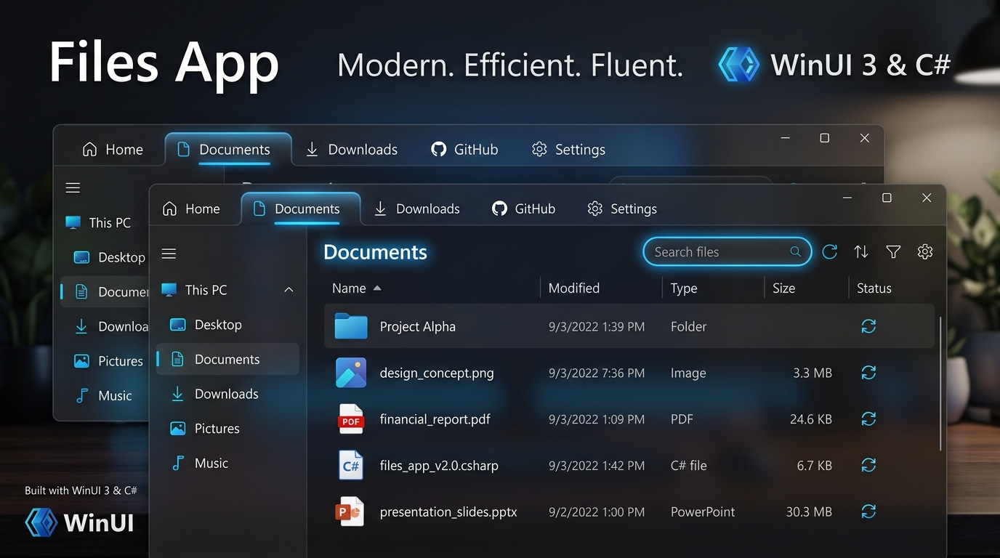
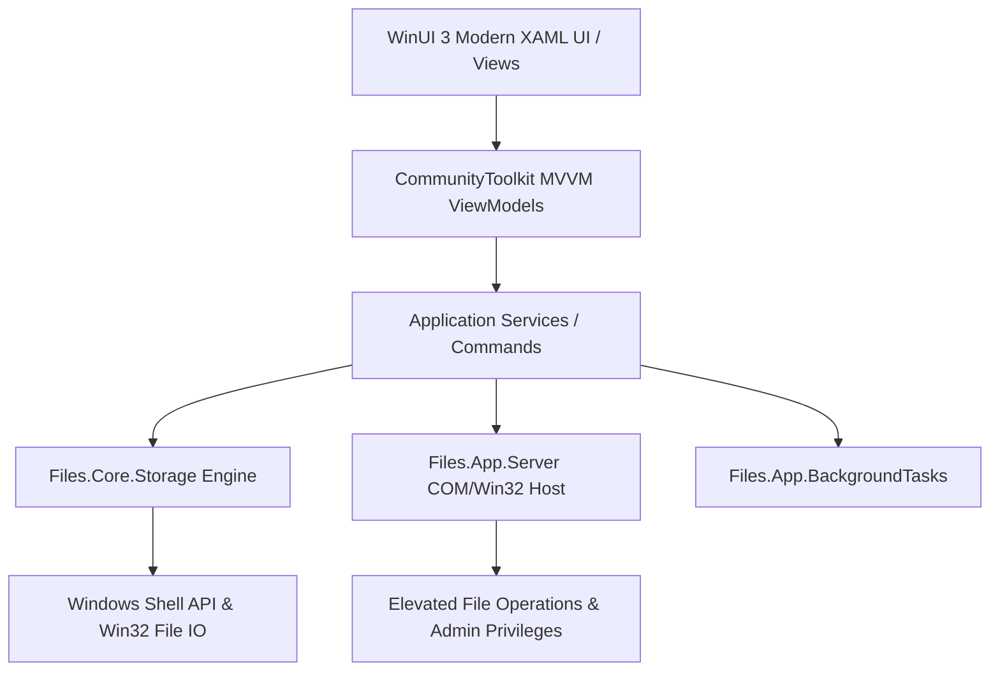
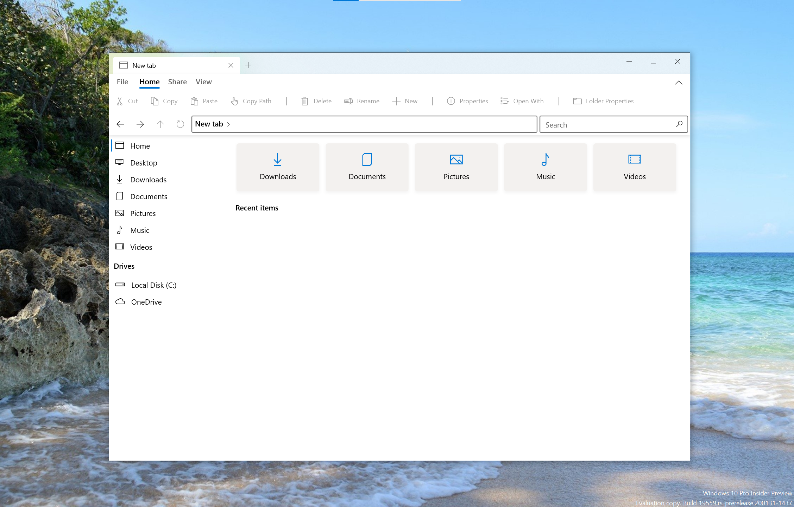
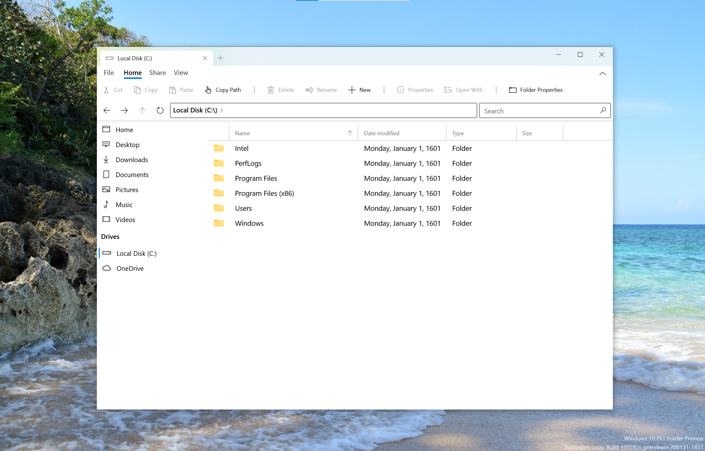

<div align="center">
  

  # Files App

  **A modern, powerful file manager for Windows built with WinUI 3, C#, and Fluent Design.**

  [](https://docs.microsoft.com/en-us/dotnet/csharp/)
  [](https://learn.microsoft.com/en-us/windows/apps/winui/winui3/)
  [](https://dotnet.microsoft.com/)
  [](https://fluent2.microsoft.design/)
  [](https://www.microsoft.com/store/apps/9NGHP3DX8HDX)
  [](LICENSE-MIT)
</div>

---

## Architectural Overview


```mermaid
flowchart TD
    UI[WinUI 3 Modern XAML UI / Views] --> ViewModel[CommunityToolkit MVVM ViewModels]
    ViewModel --> AppServices[Application Services / Commands]
    AppServices --> StorageEngine[Files.Core.Storage Engine]
    AppServices --> Win32Server[Files.App.Server COM/Win32 Host]
    
    StorageEngine --> ShellFileSystem[Windows Shell API & Win32 File IO]
    Win32Server --> ElevatedOps[Elevated File Operations & Admin Privileges]
    
    AppServices --> Background[Files.App.BackgroundTasks]
```

### Component Matrix

| Module Directory | Architecture Layer & Core Responsibility | Key Technologies / Frameworks |
|---|---|---|
| `src/Files.App` | Main desktop application entry point, XAML views, MVVM ViewModels, and UI themes | WinUI 3, CommunityToolkit.Mvvm |
| `src/Files.Core.Storage` | Cross-platform abstract storage provider contracts and file manipulation abstractions | .NET 8/9 C# Library |
| `src/Files.App.Server` | Out-of-process COM bridge for elevated file operations and Win32 shell integration | Win32 Shell API, COM Interop |
| `src/Files.App.BackgroundTasks` | Background execution tasks, file indexing, and context menu shell extensions | Windows App SDK Background Tasks |
| `src/Files.App.Controls` | Custom Fluent XAML controls (TreeViews, DataGrids, BreadcrumbBars) | WinUI 3 XAML Controls |
| `src/Files.App.Launcher` | Application bootstrap executable and protocol handler launcher | Native Win32 C# Launcher |
| `src/Files.Shared` | Shared DTOs, extension methods, constants, and logging utilities | C# Shared Library |

---

## Original Developer Documentation

## Files UWP
Meet Files, an enthusiast take on what Windows File Explorer explorer <b>should</b> be.
<br/><br/>
<a href="https://www.microsoft.com/store/apps/9NGHP3DX8HDX">Download Files UWP from the Microsoft Store.</a>

[?branchName=develop)](https://dev.azure.com/lukeblevins150823/Files%20UWP/_build/latest?definitionId=2&branchName=develop)

## Building Files UWP from the source code
- Install Visual Studio 2019 & UWP Development Kit link.
- Clone the source and open the Files.sln in VS.
- VS installs all missing dependencies for you.
- Make sure you are on the develop branch if you want the latest, otherwise you can use master for the stable version.
- Launch the package project.

## Screenshots



---

<details>
<summary><b>🇷🇺 Краткое описание на русском</b></summary>

### Обзор проекта Files
**Files** (Files App) — это современный, многофункциональный и стильный проводник файлов для операционных систем Windows 10 и 11. Проект создан с использованием **WinUI 3**, **C#** и принципов **Fluent Design**, предоставляя пользователям удобную альтернативу стандартному Проводнику Windows.

### Ключевые возможности
1. **Вкладки и двухпанельный режим**: Удобная навигация по директориям с возможностью открывать несколько вкладок и работать в разделенном экране.
2. **Интеграция с облачными сервисами**: Поддержка OneDrive, Google Drive, iCloud, Dropbox и сетевых дисков.
3. **Предпросмотр файлов**: Встроенный быстрый просмотр изображений, документов, видео и кода без открытия сторонних приложений.
4. **Тематическое оформление**: Полная поддержка темного и светлого режимов, эффектов прозрачности (Mica, Acrylic) и кастомных иконок.
5. **Теги и архивная работа**: Тегирование файлов цветными метками, поддержка распаковки и запаковки ZIP, RAR, 7z архивов.

### Инструкция по сборке из исходного кода
1. Установите **Visual Studio 2022** (или новее) с рабочей нагрузкой **Разработка приложений для Windows (WinUI 3 / Windows App SDK)**.
2. Клонируйте репозиторий:
   ```bash
   git clone https://github.com/files-community/Files.git
   ```
3. Откройте файл решения `Files.slnx` (или `Files.sln`) в Visual Studio.
4. Выберите конфигурацию `Debug` / `x64` и запустите проект `Files.App`.
</details>
