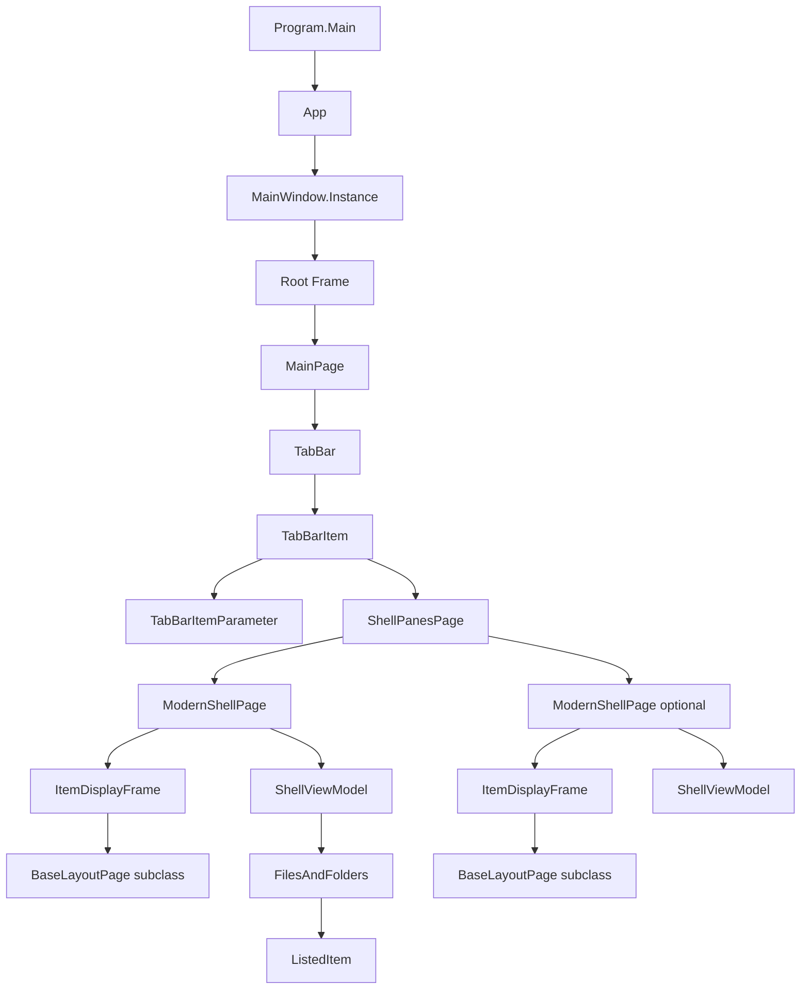

# Object Graph

This page maps the current runtime ownership graph used by the main Files UI.
It describes the implementation present in the codebase today.

## Current Ownership

- `App` configures services and starts `MainWindow`.
- `MainWindow` owns the root `Frame`.
- `MainPage` is the root page for tabs, sidebar, shelf, and global keyboard
  routing.
- `TabBarItem` represents one tab.
- `ShellPanesPage` is the content of one tab.
- `ShellPanesPage` owns one or two `ModernShellPage` panes.
- `ModernShellPage` owns a `ShellViewModel`, `CurrentInstanceViewModel`,
  toolbar view model, filesystem helpers, and item display frame.
- `ItemDisplayFrame` navigates to a layout page such as details, grid, or
  column layout.
- Layout pages display `ShellViewModel.FilesAndFolders`.
- Each displayed file/folder row is a `ListedItem`.

## Verified Absences

- No `FolderViewModel` type was found in the source tree. Current folder state
  is held by `ShellViewModel`.
- No `TabViewContainer` type was found in the source tree. Tab and pane state is
  represented by `TabBarItem`, `TabBarItemParameter`, and `ShellPanesPage`.

## Source References

- [`Program`](../../src/Files.App/Program.cs)
- [`App`](../../src/Files.App/App.xaml.cs)
- [`MainWindow`](../../src/Files.App/MainWindow.xaml.cs)
- [`MainPage`](../../src/Files.App/Views/MainPage.xaml.cs)
- [`ShellPanesPage`](../../src/Files.App/Views/ShellPanesPage.xaml.cs)
- [`ModernShellPage`](../../src/Files.App/Views/Shells/ModernShellPage.xaml.cs)
- [`BaseShellPage`](../../src/Files.App/Views/Shells/BaseShellPage.cs)
- [`BaseLayoutPage`](../../src/Files.App/Views/Layouts/BaseLayoutPage.cs)
- [`ShellViewModel`](../../src/Files.App/ViewModels/ShellViewModel.cs)
- [`ListedItem`](../../src/Files.App/Data/Items/ListedItem.cs)
