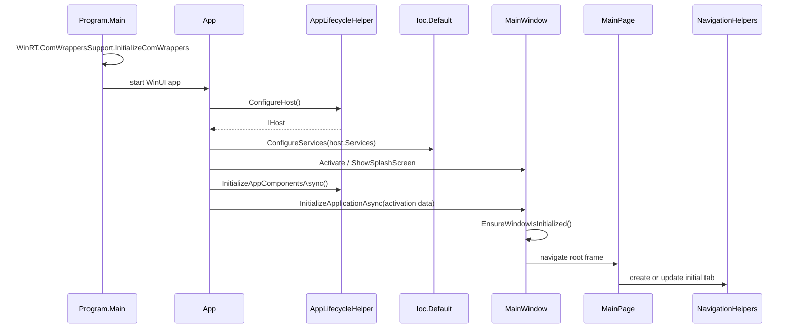

# Startup

This page documents the current Files app startup sequence.

## Startup Steps

1. `Program.Main` initializes WinRT COM wrapper support.
2. WinUI creates `App`.
3. `App.OnLaunched` configures the host through
   `AppLifecycleHelper.ConfigureHost`.
4. Host services are passed to `Ioc.Default.ConfigureServices`.
5. `MainWindow.Instance` is activated and the splash screen can be shown.
6. `AppLifecycleHelper.InitializeAppComponentsAsync` initializes app services
   such as quick access, jump list, and add-item services.
7. `MainWindow.InitializeApplicationAsync` receives activation data.
8. `MainWindow.EnsureWindowIsInitialized` creates or reuses the root frame.
9. Activation data is routed to `MainPage` or tab creation paths.
10. The initial tab navigates to the launch path, Home, Settings, Release Notes,
    or command-line/protocol target depending on activation data.

## Service Registration

`AppLifecycleHelper.ConfigureHost` registers settings services, app contexts,
Windows services, storage services, view models, and managers. Storage-related
registrations verified in the current code include:

- `IStorageService -> NativeStorageLegacyService`
- `IFtpStorageService -> FtpStorageService`
- `IStorageTrashBinService -> StorageTrashBinService`
- `IRemovableDrivesService -> RemovableDrivesService`
- `INetworkService -> NetworkService`
- `IStorageCacheService -> StorageCacheService`
- `IIconCacheService -> IconCacheService`
- `IStorageArchiveService -> StorageArchiveService`
- `IStorageSecurityService -> StorageSecurityService`
- `IWindowsJumpListService -> WindowsJumpListService`

## Shutdown Notes

`App.Window_Closed` handles tab saving or close-all behavior, output path
handling, background "leave app running" behavior, and cached properties
windows.

## Source References

- [`Program`](../../src/Files.App/Program.cs)
- [`App`](../../src/Files.App/App.xaml.cs)
- [`AppLifecycleHelper`](../../src/Files.App/Helpers/Application/AppLifecycleHelper.cs)
- [`MainWindow`](../../src/Files.App/MainWindow.xaml.cs)
- [`MainPage`](../../src/Files.App/Views/MainPage.xaml.cs)
- [`NavigationHelpers`](../../src/Files.App/Helpers/Navigation/NavigationHelpers.cs)
