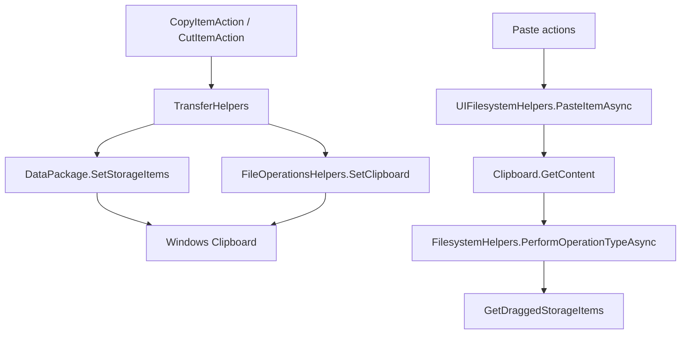

# Overview

Clipboard support currently uses WinRT `DataPackage` / `DataPackageView` for
normal app copy, cut, and paste, with a Windows Forms clipboard fallback for
file drop lists. Files also reads shell virtual-file formats for drag/drop and
clipboard operation paths.

# Architecture

# Main Types

- `AppModel`: listens to `Clipboard.ContentChanged` and updates paste state.
- `BaseTransferItemAction`: base action for copy/cut from the active content
  page.
- `CopyItemAction` and `CutItemAction`: command actions for clipboard transfer.
- `TransferHelpers`: converts selected items into storage items and writes the
  clipboard.
- `UIFilesystemHelpers`: paste entry point for UI actions.
- `FilesystemHelpers`: reads storage items, `FileDrop`, and shell virtual-file
  formats from a `DataPackageView`.
- `FileOperationsHelpers.SetClipboard`: Windows Forms fallback that writes a
  file drop list and `Preferred DropEffect`.
- `VirtualStorageFile` and `VirtualStorageFolder`: wrappers for virtual shell
  clipboard items.

# Data Flow

Copy/cut:

1. Copy or cut action calls `TransferHelpers.ExecuteTransferAsync`.
2. Selected `ListedItem` rows are resolved to `BaseStorageFile` or
   `BaseStorageFolder` through the active `ShellViewModel`.
3. A `DataPackage` is created with `RequestedOperation` set to copy or move.
4. The package family name is set and storage items are attached with
   `SetStorageItems`.
5. `Clipboard.SetContent` writes the package.
6. On unauthorized fallback, file paths are written through
   `FileOperationsHelpers.SetClipboard`.
7. Cut items have their opacity changed in the item list.

Paste:

1. Paste actions call `UIFilesystemHelpers.PasteItemAsync`.
2. The helper reads `Clipboard.GetContent`.
3. `FilesystemHelpers.PerformOperationTypeAsync` maps the requested operation
   to copy, move, recycle, link, or fallback copy.
4. Clipboard items are extracted and passed to file operation helpers.

Formats:

- `StandardDataFormats.StorageItems`
- `"FileDrop"`
- `"Preferred DropEffect"`
- `"FileGroupDescriptorW"`
- `"FileContents"`

# UI Integration

Paste command availability is updated by `AppModel.Clipboard_ContentChanged`.
Copy/cut/paste commands are exposed through rich commands, context menus,
toolbar buttons, and keyboard shortcuts. Paste-as-shortcut creates `.lnk` files
through shortcut helpers.

# Current Limitations

- Clipboard write paths use both WinRT and `System.Windows.Forms.Clipboard`.
- `FilesystemHelpers.GetDraggedStorageItems` is shared by clipboard and
  drag/drop extraction.
- Virtual file support depends on shell data object formats.
- Unknown: all clipboard formats produced by external applications. Verified
  handling is limited to the formats listed above.

# Source References

- [`AppModel`](../../src/Files.App/Data/Models/AppModel.cs)
- [`BaseTransferItemAction`](../../src/Files.App/Actions/FileSystem/Transfer/BaseTransferItemAction.cs)
- [`CopyItemAction`](../../src/Files.App/Actions/FileSystem/Transfer/CopyItemAction.cs)
- [`CutItemAction`](../../src/Files.App/Actions/FileSystem/Transfer/CutItemAction.cs)
- [`PasteItemAction`](../../src/Files.App/Actions/FileSystem/PasteItemAction.cs)
- [`PasteItemToSelectionAction`](../../src/Files.App/Actions/FileSystem/PasteItemToSelectionAction.cs)
- [`PasteItemAsShortcutAction`](../../src/Files.App/Actions/FileSystem/PasteItemAsShortcutAction.cs)
- [`TransferHelpers`](../../src/Files.App/Helpers/TransferHelpers.cs)
- [`UIFilesystemHelpers`](../../src/Files.App/Helpers/UI/UIFilesystemHelpers.cs)
- [`FilesystemHelpers`](../../src/Files.App/Utils/Storage/Operations/FilesystemHelpers.cs)
- [`FileOperationsHelpers`](../../src/Files.App/Utils/Storage/Operations/FileOperationsHelpers.cs)
- [`VirtualStorageFile`](../../src/Files.App/Utils/Storage/StorageItems/VirtualStorageFile.cs)
- [`VirtualStorageFolder`](../../src/Files.App/Utils/Storage/StorageItems/VirtualStorageFolder.cs)
