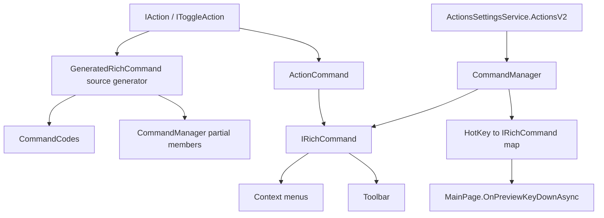

# Overview

Files currently uses a custom action and rich-command layer on top of
`System.Windows.Input.ICommand`. Most app commands are `IAction`
implementations annotated with `GeneratedRichCommand`. A source generator
creates command codes and command manager members, while runtime code wraps
actions in `ActionCommand` instances.

# Architecture

# Main Types

- `IAction`: label, description, glyph, access key, hotkeys, executable state,
  global accessibility, automation ID, and async execution.
- `IToggleAction`: action subtype with `IsOn`.
- `IRichCommand`: `ICommand` plus command metadata, hotkeys, toggle state, and
  async execution.
- `ActionCommand`: wraps one `IAction` as an `IRichCommand`.
- `ModifiableCommand`: wraps a base command with modifier variants.
- `CommandManager`: stores all rich commands and builds hotkey lookup tables.
- `ModifiableCommandManager`: exposes commands whose behavior changes with
  key modifiers.
- `ContentPageContextFlyoutFactory`: builds app context menu item models.
- `ShellContextFlyoutFactory`: loads Windows Shell context menu commands.
- `ToolbarDefaultsTemplate`: defines default toolbar item groups by context.

# Data Flow

Keyboard shortcut:

1. `MainPage.OnPreviewKeyDownAsync` builds a `HotKey` from the pressed key and
   current modifiers.
2. `CommandManager` looks up an `IRichCommand` by hotkey.
3. If the command is executable, `ActionCommand.ExecuteAsync` calls the wrapped
   `IAction.ExecuteAsync`.

Context menu:

1. `BaseLayoutPage.ItemContextFlyout_Opening` or
   `BaseContextFlyout_Opening` requests app menu items from
   `ContentPageContextFlyoutFactory`.
2. The factory filters items by current page type, selected item count, shift
   state, recycle bin, search, FTP, and ZIP flags.
3. Shell menu items are loaded separately through `ShellContextFlyoutFactory`
   for eligible locations.

Toolbar:

1. Default toolbar descriptors come from `ToolbarDefaultsTemplate`.
2. Toolbar customization settings provide the active descriptor set.
3. Descriptors resolve to rich commands through `ICommandManager`.

# UI Integration

Actions are consumed by toolbar buttons, context menus, command palette
suggestions, settings pages for key bindings, keyboard routing in `MainPage`,
and layout-specific command surfaces. Command labels and hotkey text are exposed
through `IRichCommand.LabelWithHotKey`.

# Current Limitations

- The concrete command list is generated at build time from
  `GeneratedRichCommand` annotations. The generated file is not stored under
  source control.
- Duplicate custom key bindings are recovered by restoring defaults and editing
  `ActionsSettingsService.ActionsV2`.
- Unknown: the full generated command count for a specific build, because this
  document did not read generated files under `obj`.

# Source References

- [`IAction`](../../src/Files.App/Actions/IAction.cs)
- [`IToggleAction`](../../src/Files.App/Actions/IToggleAction.cs)
- [`IRichCommand`](../../src/Files.App/Data/Commands/IRichCommand.cs)
- [`ActionCommand`](../../src/Files.App/Data/Commands/ActionCommand.cs)
- [`ModifiableCommand`](../../src/Files.App/Data/Commands/ModifiableCommand.cs)
- [`CommandManager`](../../src/Files.App/Data/Commands/Manager/CommandManager.cs)
- [`ModifiableCommandManager`](../../src/Files.App/Data/Commands/Manager/ModifiableCommandManager.cs)
- [`CommandManagerGenerator`](../../src/Files.Core.SourceGenerator/Generators/CommandManagerGenerator.cs)
- [`ContentPageContextFlyoutFactory`](../../src/Files.App/Data/Factories/ContentPageContextFlyoutFactory.cs)
- [`ShellContextFlyoutFactory`](../../src/Files.App/Data/Factories/ShellContextFlyoutHelper.cs)
- [`ToolbarDefaultsTemplate`](../../src/Files.App/Data/Items/ToolbarSections.cs)
- [`MainPage`](../../src/Files.App/Views/MainPage.xaml.cs)
