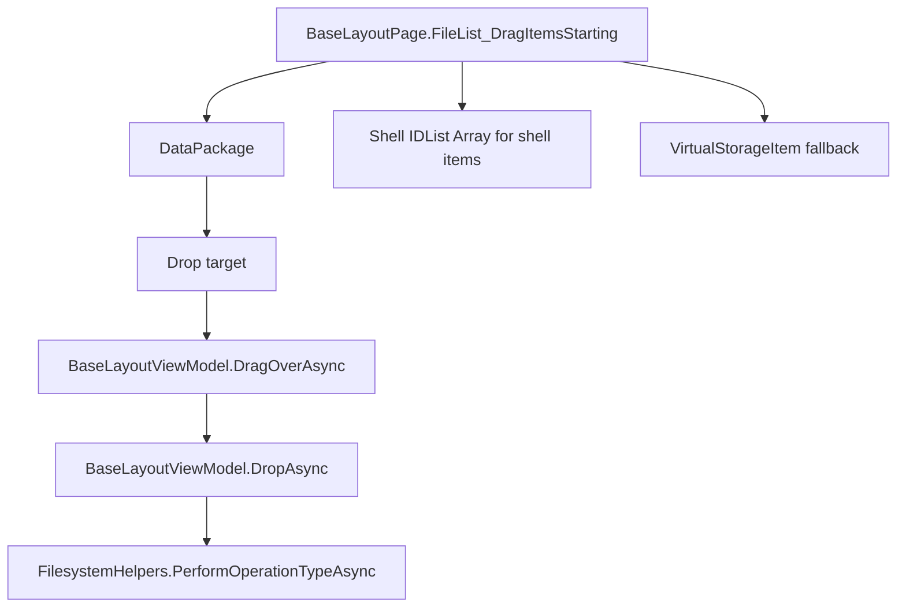

# Overview

Drag/drop currently uses WinUI drag events, WinRT data packages, and selected
Windows Shell data formats. Layout pages are drag sources and drop targets.
The sidebar, breadcrumb/address bar, tab bar, and shelf also handle drop
operations.

# Architecture

# Main Types

- `BaseLayoutPage.FileList_DragItemsStarting`: creates drag data for selected
  layout items.
- `BaseLayoutViewModel.DragOverAsync` and `DropAsync`: background drop decision
  and execution for layout pages.
- `BaseLayoutPage.Item_DragOver` and `Item_Drop`: drop-on-item behavior for
  folders, executables, and scripts.
- `FilesystemHelpers.HasDraggedStorageItems`: checks for storage items or
  `"FileDrop"`.
- `FilesystemHelpers.GetDraggedStorageItems`: extracts WinRT, file-drop, and
  virtual shell items.
- `SidebarViewModel.HandleItemDragOverAsync`: sidebar drop behavior for
  locations, drives, and tags.
- `NavigationToolbarViewModel.PathBoxItem_DragOver` and `PathBoxItem_Drop`:
  breadcrumb/address bar drop behavior.
- `VirtualStorageItem`: fallback drag item for listed items.

# Data Flow

Drag source:

1. A layout begins dragging selected rows.
2. `BaseLayoutPage.FileList_DragItemsStarting` orders selected items based on
   sorting and drag anchor.
3. For normal filesystem shell items outside search pages, it requests a shell
   `IDataObject` and injects `"Shell IDList Array"`.
4. Other items are converted to `VirtualStorageItem` values and added with
   `SetStorageItems`.
5. Allowed operations include move, copy, and link depending on source data.

Background drop:

1. `BaseLayoutViewModel.DragOverAsync` rejects unsupported pages and invalid
   packages.
2. It checks same folder, modifier keys, recycle bin, ZIP, same drive, and
   provider conditions.
3. `DropAsync` handles Git clone URLs and shelf binder menus, then calls
   `FilesystemHelpers.PerformOperationTypeAsync`.

Drop on item:

1. `BaseLayoutPage.Item_DragOver` allows folder, executable, and script targets.
2. Executable/script targets are treated as link/open-with style drops.
3. Folder targets can be opened by hover timer.
4. `Item_Drop` executes the selected operation against the target path.

# UI Integration

Drag/drop is wired in layout XAML/code-behind, sidebar view model methods, tab
bar handlers, breadcrumb handlers, and shelf pane handlers. The same storage
item extraction helpers are shared with clipboard paste.

# Current Limitations

- Drag/drop code is spread across layout pages, layout view models, sidebar,
  tab bar, toolbar, and shelf.
- Shell drag data is only used for eligible filesystem shell items.
- Some external virtual items depend on `FileGroupDescriptorW` and
  `"FileContents"` shell formats.
- Unknown: complete behavior for every external drag source. Verified formats
  match the clipboard formats and shell data objects listed here.

# Source References

- [`BaseLayoutPage`](../../src/Files.App/Views/Layouts/BaseLayoutPage.cs)
- [`BaseLayoutViewModel`](../../src/Files.App/ViewModels/Layouts/BaseLayoutViewModel.cs)
- [`SidebarViewModel`](../../src/Files.App/ViewModels/UserControls/SidebarViewModel.cs)
- [`NavigationToolbarViewModel`](../../src/Files.App/ViewModels/UserControls/NavigationToolbarViewModel.cs)
- [`FilesystemHelpers`](../../src/Files.App/Utils/Storage/Operations/FilesystemHelpers.cs)
- [`VirtualStorageItem`](../../src/Files.App/Utils/Storage/StorageItems/VirtualStorageItem.cs)
- [`TabBar`](../../src/Files.App/UserControls/TabBar/TabBar.xaml.cs)
- [`ShelfPane`](../../src/Files.App/UserControls/Pane/ShelfPane.xaml.cs)
