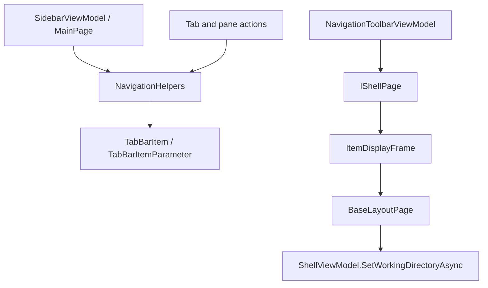

# Overview

Folder navigation currently moves through WinUI frames and shell page helpers.
The address bar, sidebar, tab actions, layout item invocation, and launch
activation paths all end up creating `NavigationArguments` or pane navigation
parameters that drive `ModernShellPage`, `ColumnShellPage`, and layout pages.

# Architecture

Back and forward navigation use the `Frame.BackStack` and
`Frame.ForwardStack` of the active shell page's item display frame. Address bar
history is stored separately in `UserSettingsService.GeneralSettingsService.PathHistoryList`.

# Main Types

- `NavigationToolbarViewModel`: address bar state, path components, omnibar
  modes, suggestions, breadcrumb drag/drop, and typed path handling.
- `NavigationHelpers`: opens paths, creates new tabs, resolves tab labels and
  icons, and handles shortcut/link/reparse point cases.
- `NavigationArguments`: carries `NavPathParam`, search state, search query,
  and selected item names.
- `PaneNavigationArguments`: carries left/right pane paths and pane arrangement.
- `BaseShellPage`: owns the toolbar view model and the frame back/forward
  helpers.
- `ModernShellPage`: normal shell navigation implementation.
- `ColumnShellPage`: column-view shell navigation implementation.
- `BaseLayoutPage`: receives `NavigationArguments` and tells `ShellViewModel`
  to load the folder or search page.

# Data Flow

Address bar path navigation:

1. The user enters or selects a path in the address toolbar.
2. `NavigationToolbarViewModel.HandleItemNavigationAsync` normalizes input,
   resolves known app destinations, folders, files, URIs, and app links.
3. Folder paths call `ContentPageContext.ShellPage.NavigateToPath`.
4. `ModernShellPage.NavigateToPath` chooses the layout page from folder
   settings and navigates `ItemDisplayFrame` with `NavigationArguments`.
5. `BaseLayoutPage.OnNavigatedTo` calls `ShellViewModel.SetWorkingDirectoryAsync`.

Back/forward:

1. `BaseShellPage.Back_Click` or `Forward_Click` reads the active frame stack.
2. The frame navigates to the previous or incoming `PageStackEntry`.
3. `ModernShellPage.ItemDisplayFrame_Navigated` updates content page state,
   tab parameters, search state, and navigation tracking.

Sidebar:

1. Sidebar item invocation reaches `SidebarViewModel` and `NavigationHelpers`.
2. Paths can open in the current pane, a new tab, a new pane, or a new window
   depending on the command.
3. `NavigationHelpers.GetSelectedTabInfoAsync` supplies display name, icon, and
   tooltip information for tabs.

# UI Integration

The address bar is backed by `NavigationToolbarViewModel.PathComponents`.
`BaseShellPage.UpdatePathUIToWorkingDirectoryAsync` populates the breadcrumb
items from the current working directory. Search submission from the toolbar
creates search `NavigationArguments` with `IsSearchResultPage = true`.

`MainPage.OnPreviewKeyDownAsync` routes keyboard navigation commands through
`ICommandManager`. Layout item invocation calls shell page navigation directly
or through column view events.

# Current Limitations

- Navigation history and file operation history are separate systems. The
  `StorageHistoryHelpers` member on `BaseShellPage` is for file operation
  undo/redo, not frame back/forward.
- Address bar path history is a settings list, while back/forward stacks are
  WinUI frame stacks.
- Unknown: the full set of URI and app-link cases accepted by the address bar
  beyond the branches verified in `NavigationToolbarViewModel`.

# Source References

- [`NavigationToolbarViewModel`](../../src/Files.App/ViewModels/UserControls/NavigationToolbarViewModel.cs)
- [`NavigationHelpers`](../../src/Files.App/Helpers/Navigation/NavigationHelpers.cs)
- [`NavigationArguments`](../../src/Files.App/Data/EventArguments/NavigationArguments.cs)
- [`PaneNavigationArguments`](../../src/Files.App/Data/EventArguments/PaneNavigationArguments.cs)
- [`BaseShellPage`](../../src/Files.App/Views/Shells/BaseShellPage.cs)
- [`ModernShellPage`](../../src/Files.App/Views/Shells/ModernShellPage.xaml.cs)
- [`ColumnShellPage`](../../src/Files.App/Views/Shells/ColumnShellPage.xaml.cs)
- [`BaseLayoutPage`](../../src/Files.App/Views/Layouts/BaseLayoutPage.cs)
