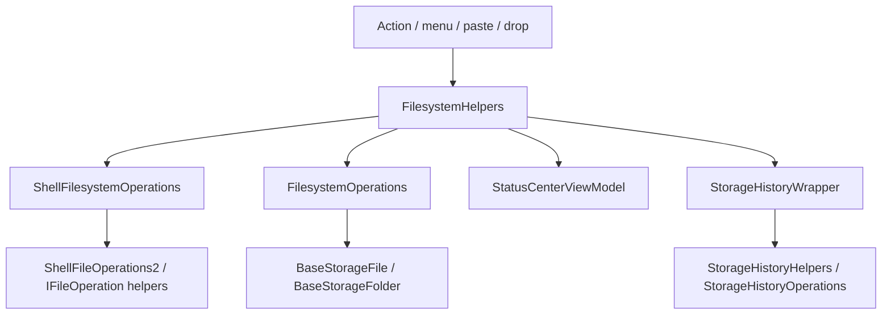

# Overview

File operations currently start from actions, context menus, toolbar buttons,
keyboard shortcuts, clipboard paste, or drag/drop. The user-facing facade is
`FilesystemHelpers`, which validates input, shows dialogs, creates Status
Center cards, invokes the concrete operation implementation, and registers
operation history when requested.

# Architecture

`ShellFilesystemOperations` is the primary path for normal shell file
operations. `FilesystemOperations` is used as a fallback for cases that are not
handled by the shell operation path, including several special path or provider
cases.

# Main Types

- `FilesystemHelpers`: per-shell-page operation facade.
- `IFilesystemOperations`: operation interface used by helper classes.
- `ShellFilesystemOperations`: shell-backed implementation using
  `ShellFileOperations2` and operation helper APIs.
- `FilesystemOperations`: fallback implementation using storage wrappers and
  lower-level file APIs.
- `FileOperationsHelpers`: helper for clipboard file-drop data and shell
  operation support.
- `StorageHistoryWrapper`: app-wide operation history list and current index.
- `StorageHistoryHelpers`: undo/redo facade owned by each shell page.
- `StorageHistoryOperations`: maps history entries to inverse operations.
- `FileOperationType`: operation type enum.

# Data Flow

Copy/move:

1. UI code calls `FilesystemHelpers.CopyItemsAsync`,
   `MoveItemsAsync`, or `PerformOperationTypeAsync`.
2. `FilesystemHelpers` converts clipboard or drag data into storage items when
   needed.
3. The helper shows overwrite/collision, property loss, file-too-large,
   in-use, or elevation-related dialogs when the operation path requires it.
4. `ShellFilesystemOperations` attempts the shell operation path.
5. `FilesystemOperations` handles fallback and provider-specific paths.
6. Status Center receives progress and result information.
7. Operation history is registered when the caller requested history.

Delete/recycle:

1. Delete actions call `FilesystemHelpers.DeleteItemsAsync`.
2. Recycle operations use `DataPackageOperation.Move` semantics or recycle-bin
   specific helper paths depending on context.
3. `StorageTrashBinService` handles recycle bin restore and empty operations.

Rename:

1. Rename actions start from selected items or layout rename UI.
2. `FilesystemHelpers.RenameAsync` handles the operation and history entry.
3. Layout and watcher refresh paths update the displayed row after rename.

Undo/redo:

1. `App.HistoryWrapper` stores `IStorageHistory` entries.
2. `StorageHistoryHelpers.TryUndo` or `TryRedo` delegates to
   `StorageHistoryOperations`.
3. The inverse operation is selected from the stored `FileOperationType`.

# UI Integration

Operation entry points exist in generated rich commands, context menu items,
toolbar buttons, paste actions, layout drag/drop handlers, sidebar drag/drop,
and recycle bin actions. The active shell page supplies `FilesystemHelpers` and
the active `ShellViewModel`.

# Current Limitations

- Delete has no inverse operation in `StorageHistoryOperations`.
- The execution path branches by provider/path type, so copy/move/delete
  behavior is not located in one class.
- Shell operations and fallback operations use different API surfaces.
- Unknown: every error code mapping surfaced by shell operations. The verified
  code handles specific dialogs and retry paths in the operation helpers.

# Source References

- [`FilesystemHelpers`](../../src/Files.App/Utils/Storage/Operations/FilesystemHelpers.cs)
- [`ShellFilesystemOperations`](../../src/Files.App/Utils/Storage/Operations/ShellFilesystemOperations.cs)
- [`FilesystemOperations`](../../src/Files.App/Utils/Storage/Operations/FilesystemOperations.cs)
- [`FileOperationsHelpers`](../../src/Files.App/Utils/Storage/Operations/FileOperationsHelpers.cs)
- [`StorageHistoryWrapper`](../../src/Files.App/Utils/Storage/History/StorageHistoryWrapper.cs)
- [`StorageHistoryHelpers`](../../src/Files.App/Utils/Storage/History/StorageHistoryHelpers.cs)
- [`StorageHistoryOperations`](../../src/Files.App/Utils/Storage/History/StorageHistoryOperations.cs)
- [`FileOperationType`](../../src/Files.App/Data/Enums/FileOperationType.cs)
- [`StorageTrashBinService`](../../src/Files.App/Services/Storage/StorageTrashBinService.cs)
