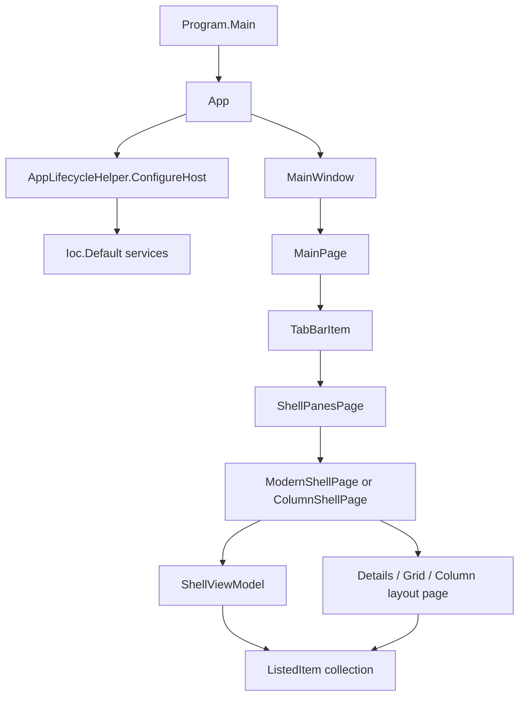

# Overview

Files is a C#/.NET WinUI 3 desktop file manager. The current implementation is
centered on a main window with tabbed shell pages. Each pane owns a shell page,
and each shell page owns a `ShellViewModel` that tracks the current folder and
the listed items shown by the active layout.

Major subsystems visible in the current codebase:

- application startup and service registration
- `MainWindow` / `MainPage` shell UI
- tabs, panes, and layout pages
- folder navigation and address bar handling
- storage wrappers and folder enumeration
- file operations and operation history
- action/command infrastructure
- selection, search, thumbnails, and properties
- clipboard and drag/drop
- Windows Shell, Win32, and COM integration

# Architecture

`App.OnLaunched` configures the host and registers services in
`Ioc.Default`. `MainWindow.InitializeApplicationAsync` handles launch,
protocol, command-line, file, and startup activation paths. `MainPage` owns the
tab UI and sidebar integration. A tab displays `ShellPanesPage`, which contains
one or two shell panes.

# Main Types

- `Program`: process entry point; initializes COM wrappers before app creation.
- `App`: WinUI application object; configures services and starts main window
  activation.
- `AppLifecycleHelper`: registers services and initializes app components.
- `MainWindow`: singleton `WindowEx` that hosts the root `Frame`.
- `MainPage`: main app page with tab bar, sidebar, shelf, and global key
  handling.
- `TabBarItem`: tab model with a `TabBarItemParameter`.
- `ShellPanesPage`: tab content that owns one or two `ModernShellPage`
  instances.
- `BaseShellPage`: common shell page behavior for toolbar, navigation,
  filesystem helpers, and history helpers.
- `ModernShellPage`: normal pane implementation.
- `ColumnShellPage`: shell page used inside column view.
- `ShellViewModel`: current folder state, item enumeration, search, thumbnails,
  properties, and watchers.
- `ListedItem`: item row model displayed by layouts.

# Data Flow

1. `Program.Main` initializes WinRT COM wrapper support and starts `App`.
2. `App.OnLaunched` calls `AppLifecycleHelper.ConfigureHost`.
3. Services are registered with `Microsoft.Extensions.Hosting` and exposed
   through `CommunityToolkit.Mvvm.DependencyInjection.Ioc`.
4. `MainWindow` creates or reuses the root `Frame`.
5. `MainWindow.InitializeApplicationAsync` navigates to `MainPage` or creates
   the initial tab based on activation data.
6. A tab hosts `ShellPanesPage`; each pane hosts a shell page.
7. Shell page navigation reaches a layout page, which asks `ShellViewModel` to
   load the folder.
8. `ShellViewModel` enumerates storage items into `ListedItem` rows.

# UI Integration

The UI is layered around WinUI pages and view models. `MainPage` handles global
keyboard shortcuts and sidebar drag/drop. `NavigationToolbarViewModel` handles
address bar state. Layout pages display `ShellViewModel.FilesAndFolders`,
maintain selection, and open context menus. Commands are exposed as
`IRichCommand` values and are bound by toolbar, menu, and keyboard surfaces.

# Current Limitations

- The codebase contains no `FolderViewModel` class; current folder state lives
  in `ShellViewModel`.
- The codebase contains no `TabViewContainer` class; tab content is represented
  by `TabBarItem`, `TabBarItemParameter`, and `ShellPanesPage`.
- `App` still exposes several services through static properties marked with
  `TODO: Replace with DI`.
- The storage implementation is spread across app code and storage projects
  rather than one runtime abstraction.

# Source References

- [`Program`](../../src/Files.App/Program.cs)
- [`App`](../../src/Files.App/App.xaml.cs)
- [`AppLifecycleHelper`](../../src/Files.App/Helpers/Application/AppLifecycleHelper.cs)
- [`MainWindow`](../../src/Files.App/MainWindow.xaml.cs)
- [`MainPage`](../../src/Files.App/Views/MainPage.xaml.cs)
- [`ShellPanesPage`](../../src/Files.App/Views/ShellPanesPage.xaml.cs)
- [`BaseShellPage`](../../src/Files.App/Views/Shells/BaseShellPage.cs)
- [`ModernShellPage`](../../src/Files.App/Views/Shells/ModernShellPage.xaml.cs)
- [`ColumnShellPage`](../../src/Files.App/Views/Shells/ColumnShellPage.xaml.cs)
- [`ShellViewModel`](../../src/Files.App/ViewModels/ShellViewModel.cs)
