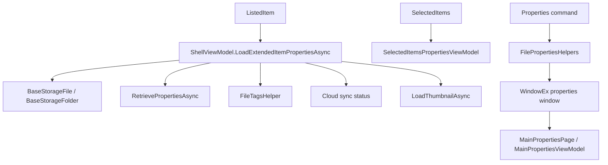

# Overview

Properties are loaded in two places today: list item metadata is loaded by
`ShellViewModel.LoadExtendedItemPropertiesAsync`, and the dedicated Properties
window is opened through `FilePropertiesHelpers` and the properties page view
models. Details view columns are managed separately by `DetailsLayoutPage` and
`ColumnsViewModel`.

# Architecture

# Main Types

- `ShellViewModel.LoadExtendedItemPropertiesAsync`: loads thumbnails, cloud sync
  status, file reference number, tags, display type, and extra shell properties.
- `GetExtraProperties`: retrieves hardcoded WinRT property keys from files and
  folders.
- `SelectedItemsPropertiesViewModel`: view model for selected item aggregate
  data.
- `FilePropertiesHelpers`: opens, positions, caches, and reuses properties
  windows.
- `MainPropertiesPage` and `MainPropertiesViewModel`: properties window shell.
- `FileProperties`, `FolderProperties`, `DriveProperties`,
  `CombinedFileProperties`, and `LibraryProperties`: item-specific properties
  models.
- `DetailsLayoutPage` and `ColumnsViewModel`: details view column visibility,
  sorting, and sizing.

# Data Flow

List item metadata:

1. A `ListedItem` is created during enumeration.
2. `ShellViewModel.LoadExtendedItemPropertiesAsync` resolves the matching
   `BaseStorageFile` or `BaseStorageFolder`.
3. Thumbnails are loaded first.
4. File/folder sync status and file tags are read.
5. Extra properties are retrieved:
   - files: `System.Image.Dimensions`, `System.Media.Duration`,
     `System.FileVersion`
   - folders: `System.FreeSpace`, `System.Capacity`, `System.SFGAOFlags`
6. `ContextualProperty` is set from image dimensions, media duration, version,
   or modified date depending on available data.

Properties window:

1. A Properties command calls `FilePropertiesHelpers.OpenPropertiesWindow`.
2. If items are selected, the parameter is a single selected item or the
   selected item list.
3. If nothing is selected, the parameter is the current folder or a matching
   `DriveItem`.
4. A cached `WindowEx` is reused when available.
5. The frame navigates to `MainPropertiesPage` with
   `PropertiesPageNavigationParameter`.

Details columns:

1. `DetailsLayoutPage` copies persisted column state from folder settings into
   its `ColumnsViewModel`.
2. User column visibility and width changes update folder settings.
3. Recycle bin, search, cloud sync, and Git state control which columns are
   visible.

# UI Integration

Properties feed details view cells, info/details panes, status text, context
menus, and the standalone properties window. Details column commands are part
of the details layout header menu.

# Current Limitations

- The list metadata loader uses a fixed set of WinRT property keys.
- Property loading is tied to `ShellViewModel` and layout refresh timing.
- Properties windows are cached because destroying the window object is noted
  in code as causing access violations.
- Unknown: all shell extension property fields visible in Windows Explorer; the
  verified code reads only the hardcoded keys listed above.

# Source References

- [`ShellViewModel`](../../src/Files.App/ViewModels/ShellViewModel.cs)
- [`SelectedItemsPropertiesViewModel`](../../src/Files.App/Data/Models/SelectedItemsPropertiesViewModel.cs)
- [`FilePropertiesHelpers`](../../src/Files.App/Utils/Storage/Helpers/FilePropertiesHelpers.cs)
- [`MainPropertiesViewModel`](../../src/Files.App/ViewModels/Properties/MainPropertiesViewModel.cs)
- [`MainPropertiesPage`](../../src/Files.App/Views/Properties/MainPropertiesPage.xaml.cs)
- [`FileProperties`](../../src/Files.App/ViewModels/Properties/Items/FileProperties.cs)
- [`FolderProperties`](../../src/Files.App/ViewModels/Properties/Items/FolderProperties.cs)
- [`DriveProperties`](../../src/Files.App/ViewModels/Properties/Items/DriveProperties.cs)
- [`DetailsLayoutPage`](../../src/Files.App/Views/Layouts/DetailsLayoutPage.xaml.cs)
- [`ColumnsViewModel`](../../src/Files.App/Data/Models/ColumnsViewModel.cs)
