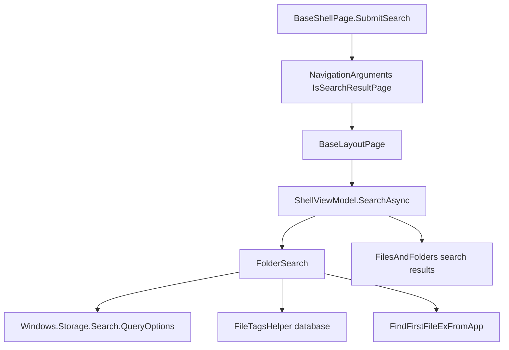

# Overview

Search is implemented by `FolderSearch`, `ShellViewModel.SearchAsync`, and
search navigation through shell pages. The current code supports tag search,
home-wide search, indexed WinRT queries where available, Win32 filename search
for non-AQS cases, and in-folder filtering of already loaded items.

# Architecture

# Main Types

- `FolderSearch`: search engine for folder, home, tag, AQS, indexed, and
  filename queries.
- `ShellViewModel.SearchAsync`: clears the item collection, marks the page as
  search results, disables watchers, and applies incoming search ticks.
- `NavigationArguments`: carries `SearchQuery`, `SearchPathParam`, and
  `IsSearchResultPage`.
- `NavigationToolbarViewModel`: creates search suggestions and accepts search
  mode input.
- `BaseShellPage.SubmitSearch`: creates search navigation.
- `FileTagsHelper`: tag database access used by tag search.

# Data Flow

Search navigation:

1. Search is submitted from the shell toolbar or tag navigation.
2. `BaseShellPage.SubmitSearch` creates `NavigationArguments` with
   `IsSearchResultPage = true`.
3. `BaseLayoutPage.OnNavigatedTo` sets the working directory to
   `SearchPathParam`.
4. `ShellViewModel.SearchAsync` creates a `FolderSearch` and clears current
   display state.
5. Results are added through search ticks and then sorted/grouped like normal
   folder items.

Query handling:

1. `FolderSearch.IsAQSQuery` treats queries starting with `$` or containing
   `:` as AQS-style queries.
2. For non-AQS names, the query can be converted to a wildcard filename query.
3. `QueryOptions` uses deep folder depth, indexer-when-available behavior, and
   search rank sorting.
4. Tag expressions are evaluated against the file tag database.
5. A non-AQS fallback can use `FindFirstFileExFromApp` with the wildcard query.

Filtering:

1. `ShellViewModel.FilesAndFoldersFilter` is debounced.
2. `ApplyFilesAndFoldersChangesAsync` filters the displayed collection by item
   name containment.

# UI Integration

Search result pages use the normal layout pages but set page type flags in
`CurrentInstanceViewModel`. The address bar display text is overridden with
search context text, and context menu filtering receives the search page flag.

# Current Limitations

- Search pages set `HasNoWatcher`, so live folder watching is disabled for the
  result view.
- Filtering only applies to the already loaded item collection.
- Search behavior differs by query type and provider because the implementation
  mixes WinRT query APIs, tag database lookup, and Win32 filename search.
- Unknown: complete Windows Search index availability for every folder and
  provider at runtime.

# Source References

- [`FolderSearch`](../../src/Files.App/Utils/Storage/Search/FolderSearch.cs)
- [`ShellViewModel`](../../src/Files.App/ViewModels/ShellViewModel.cs)
- [`BaseShellPage`](../../src/Files.App/Views/Shells/BaseShellPage.cs)
- [`BaseLayoutPage`](../../src/Files.App/Views/Layouts/BaseLayoutPage.cs)
- [`NavigationToolbarViewModel`](../../src/Files.App/ViewModels/UserControls/NavigationToolbarViewModel.cs)
- [`NavigationArguments`](../../src/Files.App/Data/EventArguments/NavigationArguments.cs)
- [`FileTagsHelper`](../../src/Files.App/Utils/FileTags/FileTagsHelper.cs)
