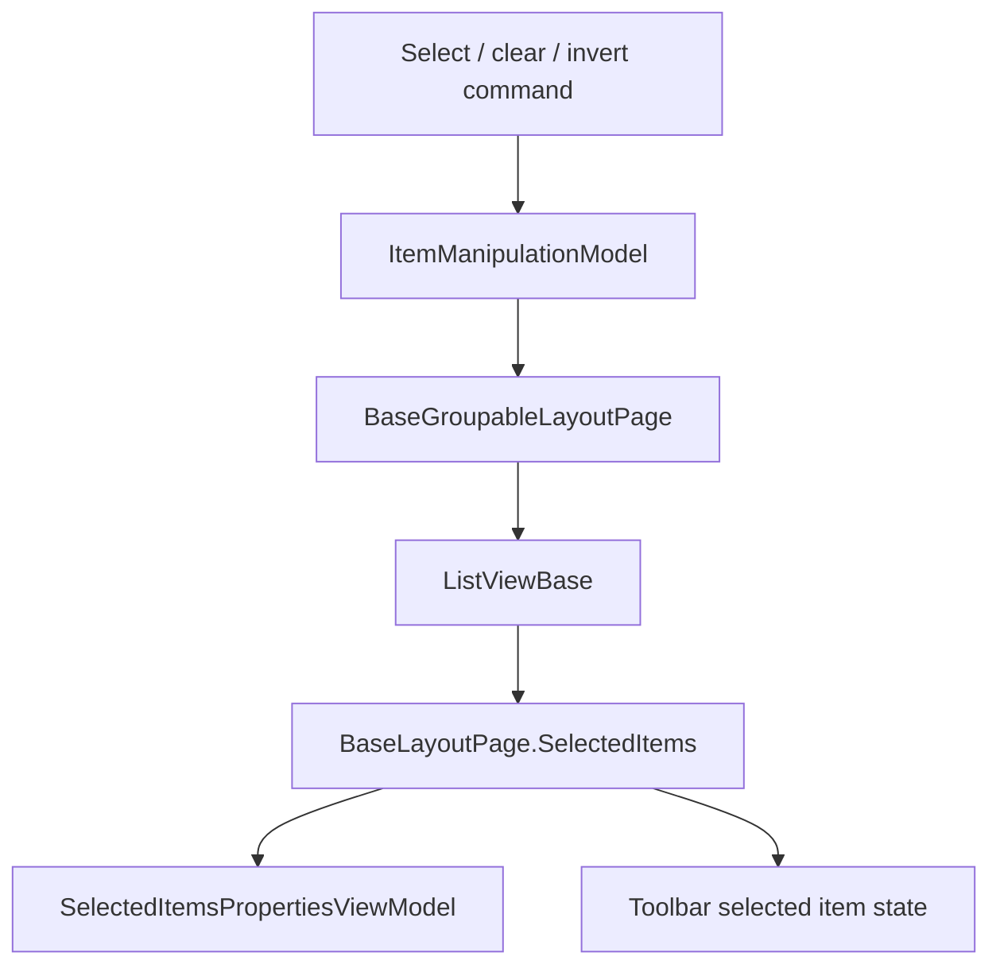

# Overview

Selection is owned by layout pages, not by `ShellViewModel`. Layout pages keep
selected `ListedItem` instances, update the toolbar and properties view model,
and use `ItemManipulationModel` as an event hub for common selection commands.

# Architecture

# Main Types

- `ItemManipulationModel`: exposes events for focus, select all, clear
  selection, invert selection, add/remove selected item, rename, scroll, and
  thumbnail refresh.
- `BaseLayoutPage`: owns `SelectedItems`, `SelectedItem`,
  `SelectedItemsPropertiesViewModel`, and selection restoration on navigation.
- `BaseGroupableLayoutPage`: connects `ItemManipulationModel` events to the
  concrete `ListViewBase`.
- `DetailsLayoutPage`, `GridLayoutPage`, and `ColumnLayoutPage`: implement
  layout-specific focus, scroll, select, and remove behavior.
- `RectangleSelection`: selection rectangle helper used by layouts.
- `NavigationArguments.SelectItems`: item names selected after navigation.

# Data Flow

Normal selection:

1. The user selects rows in a layout `ListViewBase`.
2. `FileList_SelectionChanged` updates `BaseLayoutPage.SelectedItems`.
3. The selected list is sorted lazily using folder settings when needed.
4. The selected item anchor and selected properties view model are updated.
5. Toolbar command state and status text are refreshed.

Select all / clear / invert:

1. A command raises an event on `ItemManipulationModel`.
2. `BaseGroupableLayoutPage` handles the event.
3. The concrete layout updates `ListViewBase.SelectedItems`.

Selection restoration:

1. A navigation path can carry `NavigationArguments.SelectItems`.
2. `BaseLayoutPage.SetSelectedItemsOnNavigation` matches those names against
   `ShellViewModel.FilesAndFolders`.
3. Matching `ListedItem` rows are selected in the layout.

# UI Integration

Selection drives the item context menu, command executable state, details/info
panes, status bar size display, rename behavior, and properties window input.
The active content page is exposed through context services so actions can read
current selection without directly owning the layout.

# Current Limitations

- No dedicated persistent selection store was found.
- Selection restoration is name-based through `NavigationArguments.SelectItems`.
- Layout pages implement some selection behavior separately because details,
  grid, and column views have different visual containers.
- Unknown: persistence of selection across app restarts was not verified in the
  current code paths.

# Source References

- [`ItemManipulationModel`](../../src/Files.App/Data/Models/ItemManipulationModel.cs)
- [`BaseLayoutPage`](../../src/Files.App/Views/Layouts/BaseLayoutPage.cs)
- [`BaseGroupableLayoutPage`](../../src/Files.App/Views/Layouts/BaseGroupableLayoutPage.cs)
- [`DetailsLayoutPage`](../../src/Files.App/Views/Layouts/DetailsLayoutPage.xaml.cs)
- [`GridLayoutPage`](../../src/Files.App/Views/Layouts/GridLayoutPage.xaml.cs)
- [`ColumnLayoutPage`](../../src/Files.App/Views/Layouts/ColumnLayoutPage.xaml.cs)
- [`NavigationArguments`](../../src/Files.App/Data/EventArguments/NavigationArguments.cs)
- [`SelectedItemsPropertiesViewModel`](../../src/Files.App/Data/Models/SelectedItemsPropertiesViewModel.cs)
