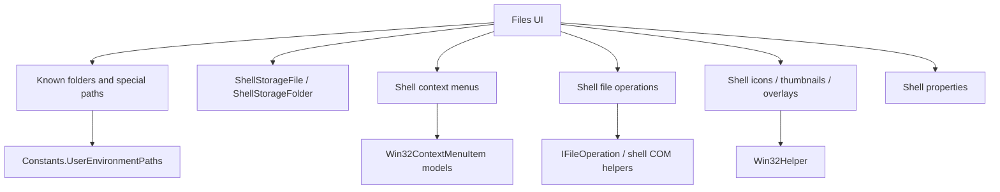

# Overview

Windows Shell integration is a major part of the current Files implementation.
It appears in navigation labels/icons, known folders, recycle bin support,
shell namespace wrappers, file operations, context menus, thumbnails, overlays,
properties, jump lists, and drag/drop data objects.

# Architecture

# Main Types

- `Constants.UserEnvironmentPaths`: special paths such as recycle bin, This PC,
  network, and known folder mappings.
- `NavigationHelpers.GetSelectedTabInfoAsync`: resolves tab titles, icons, and
  labels for special paths and shell-backed locations.
- `ShellStorageFile` and `ShellStorageFolder`: storage wrappers for shell
  namespace items.
- `ShellFileItem` and shell folder extensions: shell item conversion helpers.
- `StorageTrashBinService`: recycle bin Shell API integration.
- `ShellFilesystemOperations`: shell-backed file operation execution.
- `FileOperationsHelpers`: helper surface for shell operations and clipboard
  drop effects.
- `ContentPageContextFlyoutFactory` and `ShellContextFlyoutFactory`: app menu
  and shell menu integration.
- `FileThumbnailHelper`: shell icon and overlay loading through `Win32Helper`.
- `WindowsJumpListService`: Windows jump list integration.
- `NativeMethods.txt`: CsWin32 generator input for native APIs.

# Data Flow

Known folders and tab labels:

1. Navigation paths are compared against known special paths and shell roots.
2. `NavigationHelpers.GetSelectedTabInfoAsync` returns display title, icon, and
   tooltip information.
3. `TabBarItemParameter` is updated for tab UI display.

Shell items:

1. Some paths resolve through `ShellStorageFile` or `ShellStorageFolder`.
2. Shell-backed items can still be projected as `ListedItem` rows.
3. Operations and properties resolve back to storage wrappers when needed.

File operations:

1. `FilesystemHelpers` routes normal operations to `ShellFilesystemOperations`
   first.
2. Shell operation helpers use shell APIs and COM-backed operation behavior.
3. Fallback operation paths handle cases outside the shell operation path.

Context menus:

1. App context menu items are built first.
2. Shell menu items are loaded asynchronously through
   `ShellContextFlyoutFactory.GetShellContextmenuAsync`.
3. Open With, Send To, BitLocker, and overflow shell entries are placed into
   app flyout placeholders or overflow menus.

Thumbnails and properties:

1. `FileThumbnailHelper` calls `Win32Helper.GetIcon` and
   `Win32Helper.GetIconOverlay` on an STA task.
2. `ShellViewModel.GetExtraProperties` retrieves selected WinRT shell property
   keys for files and folders.

# UI Integration

Shell integration is visible in the sidebar, Home widgets, tab labels,
context menus, toolbar commands, drag/drop, Status Center operation progress,
properties windows, thumbnails, and recycle bin pages.

# Current Limitations

- Shell integration is spread across helpers, services, storage wrappers,
  factories, and view models.
- Some shell context menu loading failures are swallowed in
  `ShellContextFlyoutFactory.LoadShellMenuItemsAsync`.
- The app still references Vanara packages in `Files.App.csproj` while also
  using CsWin32 through `Files.App.CsWin32`.
- Unknown: exact behavior of every installed third-party shell extension.

# Source References

- [`Constants`](../../src/Files.App/Constants.cs)
- [`NavigationHelpers`](../../src/Files.App/Helpers/Navigation/NavigationHelpers.cs)
- [`ShellStorageFile`](../../src/Files.App/Utils/Storage/StorageItems/ShellStorageFile.cs)
- [`ShellStorageFolder`](../../src/Files.App/Utils/Storage/StorageItems/ShellStorageFolder.cs)
- [`StorageTrashBinService`](../../src/Files.App/Services/Storage/StorageTrashBinService.cs)
- [`ShellFilesystemOperations`](../../src/Files.App/Utils/Storage/Operations/ShellFilesystemOperations.cs)
- [`FileOperationsHelpers`](../../src/Files.App/Utils/Storage/Operations/FileOperationsHelpers.cs)
- [`ContentPageContextFlyoutFactory`](../../src/Files.App/Data/Factories/ContentPageContextFlyoutFactory.cs)
- [`ShellContextFlyoutFactory`](../../src/Files.App/Data/Factories/ShellContextFlyoutHelper.cs)
- [`FileThumbnailHelper`](../../src/Files.App/Utils/Storage/Helpers/FileThumbnailHelper.cs)
- [`WindowsJumpListService`](../../src/Files.App/Services/Windows/WindowsJumpListService.cs)
- [`NativeMethods.txt`](../../src/Files.App.CsWin32/NativeMethods.txt)
