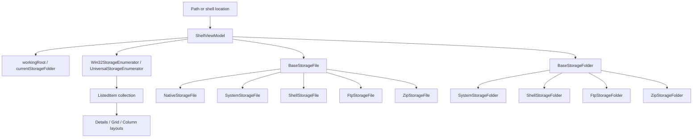

# Overview

This document describes the storage representation used by Files today. The
current code has several storage-shaped layers:

- `ListedItem` is the UI-facing item model used by folder layouts.
- `BaseStorageFile` and `BaseStorageFolder` are WinRT-shaped wrappers used by
  file operations, property loading, clipboard conversion, and previews.
- `DriveItem` is the drive/navigation representation used by Home and Sidebar.
- `RecycleBinItem` is a `ListedItem` subtype for recycle bin rows.
- `ShellViewModel` owns the current folder, enumerates items, and converts paths
  into storage wrappers.

# Architecture

`ShellViewModel.GetFileFromPathAsync` and `ShellViewModel.GetFolderFromPathAsync`
delegate to `StorageFileExtensions.DangerousGetFileFromPathAsync` and
`DangerousGetFolderFromPathAsync`. Those helpers eventually call
`BaseStorageFile.GetFileFromPathAsync` or `BaseStorageFolder.GetFolderFromPathAsync`.

The static wrapper selection order verified in code is:

- files: `ZipStorageFile`, `FtpStorageFile`, `ShellStorageFile`,
  `NativeStorageFile`, `SystemStorageFile`
- folders: `ZipStorageFolder`, `FtpStorageFolder`, `ShellStorageFolder`,
  `SystemStorageFolder`

# Main Types

- `ListedItem`: observable UI model with path, raw name, display name, item
  type, dates, size, icon, tags, sync status, and optional `ItemFile`.
- `RecycleBinItem`: `ListedItem` subtype with deleted date, original path, and
  original folder.
- `FtpItem`, `ShortcutItem`, `LibraryItem`, `GitItem`, `ZipItem`, and
  `AlternateStreamItem`: specialized listed item shapes used by enumeration or
  feature-specific UI.
- `BaseStorageFile`: abstract file wrapper implementing WinRT-like file
  members and path-aware behavior.
- `BaseStorageFolder`: abstract folder wrapper implementing WinRT-like folder
  members and path-aware behavior.
- `DriveItem`: sidebar/home drive model implementing `INavigationControlItem`
  and OwlCore `IFolder`.
- `StorageTrashBinService`: recycle bin service backed by Windows Shell APIs.
- `Win32StorageEnumerator`: enumerates accessible local folders with Win32 file
  APIs and produces `ListedItem` rows.
- `UniversalStorageEnumerator`: enumerates via `BaseStorageFolder` and is used
  for fallback, FTP, Box, archives, and shell-backed folders.

# Data Flow

1. A pane navigates to a path through `ModernShellPage` or `ColumnShellPage`.
2. `BaseLayoutPage.OnNavigatedTo` calls
   `ShellViewModel.SetWorkingDirectoryAsync` for normal folder pages.
3. `ShellViewModel.RefreshItems` starts `RapidAddItemsToCollectionAsync`.
4. `EnumerateItemsFromStandardFolderAsync` chooses Win32 or universal
   enumeration and fills the backing `ConcurrentCollection<ListedItem>`.
5. `ApplyFilesAndFoldersChangesAsync` projects items into the observable
   collection used by layout pages.
6. Thumbnail and extended property loading run after rows exist.

# UI Integration

Folder layouts bind to `ShellViewModel.FilesAndFolders`. Selection and item
commands operate on `ListedItem` instances, then resolve files or folders back
to `BaseStorageFile` / `BaseStorageFolder` when storage APIs are needed.

Home and Sidebar use `DriveItem` and other navigation item models. Recycle bin
pages display `RecycleBinItem` rows and call `StorageTrashBinService` for
recycle-bin-specific actions.

# Current Limitations

- The current implementation is not a single storage abstraction; storage logic
  is split across UI models, wrapper classes, shell view models, services, and
  operation helpers.
- `ListedItem` is both a UI row model and a carrier for storage metadata used by
  commands and property loading.
- Watcher support depends on the enumeration path. FTP, WSL distro roots, MTP,
  and ZIP folders set `HasNoWatcher`.
- Unknown: the complete behavior of every shell namespace item. The verified
  code paths cover the wrapper types and enumerators listed above.

# Source References

- [`ShellViewModel`](../../src/Files.App/ViewModels/ShellViewModel.cs)
- [`ListedItem`](../../src/Files.App/Data/Items/ListedItem.cs)
- [`DriveItem`](../../src/Files.App/Data/Items/DriveItem.cs)
- [`BaseStorageFile`](../../src/Files.App/Utils/Storage/StorageBaseItems/BaseStorageFile.cs)
- [`BaseStorageFolder`](../../src/Files.App/Utils/Storage/StorageBaseItems/BaseStorageFolder.cs)
- [`StorageFileExtensions`](../../src/Files.App/Utils/Storage/Helpers/StorageFileExtensions.cs)
- [`Win32StorageEnumerator`](../../src/Files.App/Utils/Storage/Enumerators/Win32StorageEnumerator.cs)
- [`UniversalStorageEnumerator`](../../src/Files.App/Utils/Storage/Enumerators/UniversalStorageEnumerator.cs)
- [`StorageTrashBinService`](../../src/Files.App/Services/Storage/StorageTrashBinService.cs)
