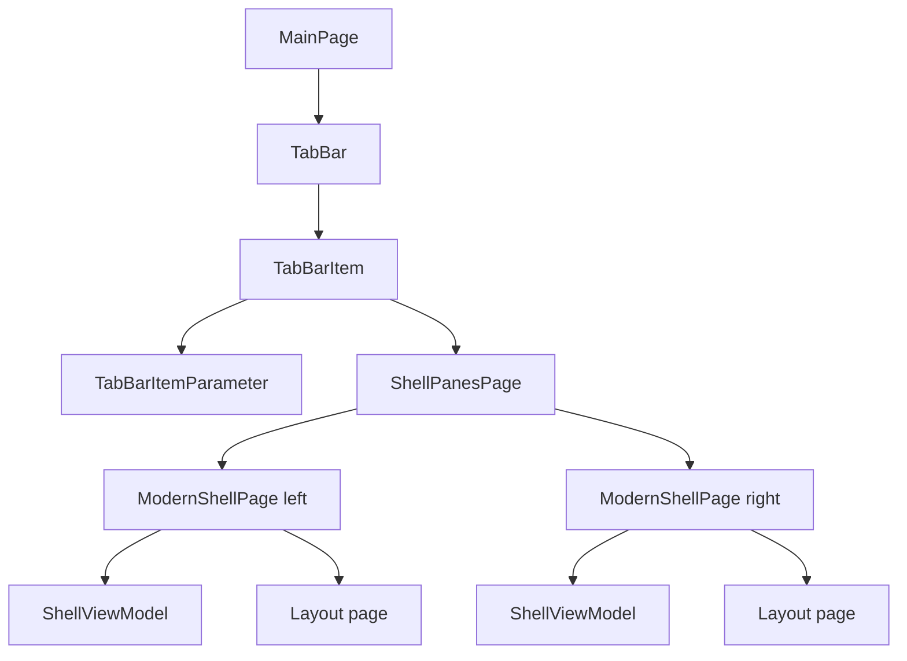

# Overview

Tabs and panes are managed by the tab bar, `TabBarItem`, `ShellPanesPage`, and
shell pages. The current codebase does not contain `TabViewContainer` or
`FolderViewModel` classes. The equivalent runtime state is split across
`TabBarItemParameter`, `ShellPanesPage`, `ModernShellPage`, `ColumnShellPage`,
`CurrentInstanceViewModel`, and `ShellViewModel`.

# Architecture

`ShellPanesPage` is the tab content. It creates pane pages with
`new ModernShellPage { PaneHolder = this }` and stores navigation parameters
for the left and right panes.

# Main Types

- `TabBarItem`: tab item model used by the tab bar.
- `TabBarItemParameter`: carries navigation parameter, header, icon, tooltip,
  and tab-related state.
- `ShellPanesPage`: page hosted by a tab; owns one or two shell panes.
- `IShellPanesPage`: pane holder contract.
- `BaseShellPage`: common shell page behavior.
- `ModernShellPage`: normal shell pane.
- `ColumnShellPage`: shell page nested inside column view.
- `CurrentInstanceViewModel`: per-shell-page UI state such as layout settings,
  page type, search query, and selection-related status.
- `ShellViewModel`: per-shell-page current folder and listed item state.

# Data Flow

Initial tab:

1. `MainWindow.InitializeApplicationAsync` routes activation data.
2. `NavigationHelpers.AddNewTabByPathAsync` creates a `TabBarItem`.
3. The tab hosts `ShellPanesPage`.
4. `ShellPanesPage.OnNavigatedTo` initializes left and optional right pane
   navigation parameters.
5. Each `ModernShellPage` navigates to the requested path.

Second pane:

1. Commands call pane operations on `ShellPanesPage`.
2. `OpenSecondaryPane` adds another `ModernShellPage`.
3. `ActivePane`, `ActivePaneOrColumn`, and `ShellPaneArrangement` track the
   active pane and arrangement.
4. `CloseActivePane`, `CloseOtherPane`, and `FocusOtherPane` update pane state.

# UI Integration

`MainPage` and tab bar controls select the active tab. `ShellPanesPage` updates
pane state and exposes the active pane to commands through app contexts. Each
shell page owns its toolbar, filesystem helpers, and `ShellViewModel`.

Compact window behavior removes or restores the right pane in
`ShellPanesPage`. Column view uses `ColumnShellPage` and `ColumnsLayoutPage`
inside a shell pane, with column-specific navigation events.

# Current Limitations

- There is no single tab container class named `TabViewContainer`.
- There is no `FolderViewModel`; folder state is currently in `ShellViewModel`.
- A tab can contain one or two pane pages in the verified `ShellPanesPage` code.
- Navigation state is carried by several objects rather than one state object.

# Source References

- [`TabBarItem`](../../src/Files.App/UserControls/TabBar/TabBarItem.cs)
- [`TabBarItemParameter`](../../src/Files.App/Data/Parameters/TabBarItemParameter.cs)
- [`ShellPanesPage`](../../src/Files.App/Views/ShellPanesPage.xaml.cs)
- [`IShellPanesPage`](../../src/Files.App/Data/Contracts/IShellPanesPage.cs)
- [`BaseShellPage`](../../src/Files.App/Views/Shells/BaseShellPage.cs)
- [`ModernShellPage`](../../src/Files.App/Views/Shells/ModernShellPage.xaml.cs)
- [`ColumnShellPage`](../../src/Files.App/Views/Shells/ColumnShellPage.xaml.cs)
- [`CurrentInstanceViewModel`](../../src/Files.App/Data/Models/CurrentInstanceViewModel.cs)
- [`ShellViewModel`](../../src/Files.App/ViewModels/ShellViewModel.cs)
