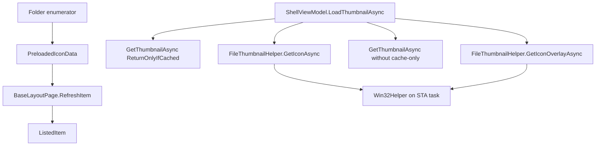

# Overview

Thumbnail loading is coordinated by `ShellViewModel`. Rows are created first,
then thumbnails, icons, overlays, and delayed retries are applied to
`ListedItem` instances. The implementation uses WinRT thumbnails when available
and Win32 shell icon helpers for icon fallback and overlays.

# Architecture

# Main Types

- `ShellViewModel.LoadThumbnailAsync`: primary thumbnail and icon loading path.
- `FileThumbnailHelper`: Win32 shell icon and overlay helper.
- `Win32StorageEnumerator` and `UniversalStorageEnumerator`: can preload icon
  bytes through `IIconCacheService`.
- `IIconCacheService`: icon cache service registered in app DI.
- `IStorageCacheService`: file list cache service used by `ShellViewModel`.
- `ListedItem`: stores icon, thumbnail-related state, and delayed thumbnail
  flags.

# Data Flow

1. Enumeration creates `ListedItem` rows, sometimes with preloaded icon data.
2. Layout refresh applies preloaded icon data where present.
3. `ShellViewModel.LoadExtendedItemPropertiesAsync` calls
   `LoadThumbnailAsync`.
4. `LoadThumbnailAsync` checks layout icon size and the `ShowThumbnails`
   setting.
5. For small icons or disabled thumbnails, it loads icon-only data.
6. For folders and non-executable files, it first tries a cached thumbnail with
   `ThumbnailOptions.ReturnOnlyIfCached`.
7. If no cached thumbnail is available, it falls back to icon data and then
   loads a non-cached thumbnail in the background.
8. Icon overlays are loaded through `FileThumbnailHelper.GetIconOverlayAsync`.
9. A failed non-cached thumbnail load can mark the item for delayed retry.

# UI Integration

Layout pages display `ListedItem` image data and ask the shell view model to
refresh item thumbnails. Details, grid, and column views share the listed item
state, while icon size comes from the active folder layout mode.

# Current Limitations

- Thumbnail loading is tied to `ShellViewModel` and `ListedItem`, not a separate
  thumbnail provider interface.
- Some failures result in delayed retry state rather than immediate final data.
- Win32 icon work is executed on an STA task through `FileThumbnailHelper`.
- Unknown: exact cache storage format for every thumbnail source from this
  document's verified paths.

# Source References

- [`ShellViewModel`](../../src/Files.App/ViewModels/ShellViewModel.cs)
- [`FileThumbnailHelper`](../../src/Files.App/Utils/Storage/Helpers/FileThumbnailHelper.cs)
- [`Win32StorageEnumerator`](../../src/Files.App/Utils/Storage/Enumerators/Win32StorageEnumerator.cs)
- [`UniversalStorageEnumerator`](../../src/Files.App/Utils/Storage/Enumerators/UniversalStorageEnumerator.cs)
- [`ListedItem`](../../src/Files.App/Data/Items/ListedItem.cs)
- [`IIconCacheService`](../../src/Files.App/Data/Contracts/IIconCacheService.cs)
- [`IStorageCacheService`](../../src/Files.App/Data/Contracts/IStorageCacheService.cs)
