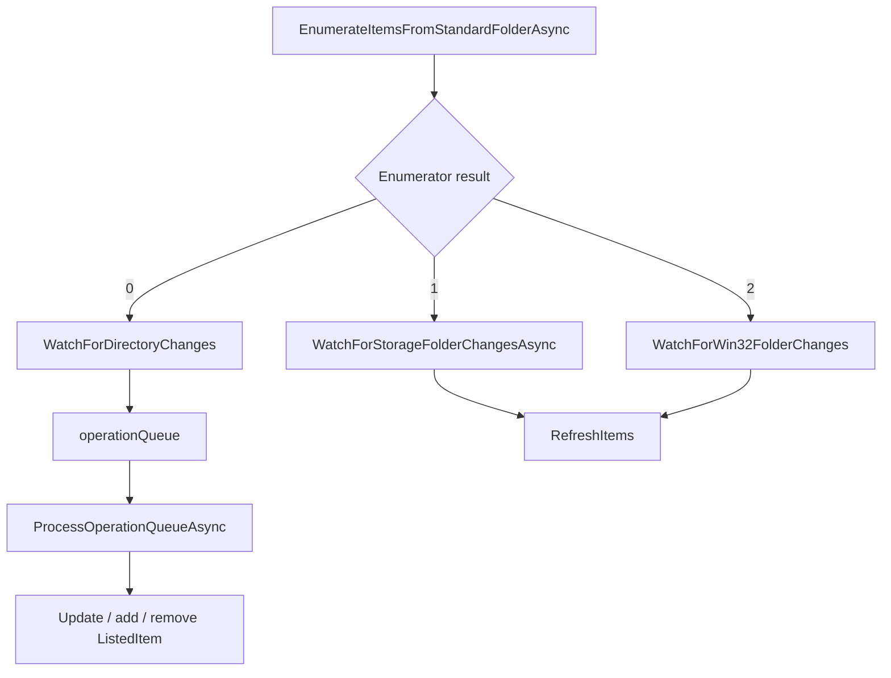

# Overview

Folder updates are watched by `ShellViewModel` after folder enumeration. The
watcher implementation depends on the enumeration path and provider type:
Win32 `ReadDirectoryChangesW`, WinRT `StorageFolderQueryResult`, or
`FileSystemWatcher`.

# Architecture

# Main Types

- `ShellViewModel.CloseWatcher`: disposes watcher state and cancels watcher
  tokens.
- `WatchForDirectoryChanges`: Win32 watcher using `CreateFileFromApp`,
  `ReadDirectoryChangesW`, overlapped events, and `WaitForSingleObjectEx`.
- `ProcessOperationQueueAsync`: batches Win32 watcher events and updates the
  listed items.
- `WatchForStorageFolderChangesAsync`: WinRT query-result watcher using
  `ContentsChanged`.
- `WatchForWin32FolderChanges`: `FileSystemWatcher` fallback.
- `WatchForGitChanges`: recursive Git repository watcher.
- `StorageTrashBinService.Watcher`: recycle bin watcher service.
- `RecycleBinWatcher`: recycle bin watcher implementation in
  `Files.App.Storage`.

# Data Flow

1. `RapidAddItemsToCollectionAsync` finishes enumeration.
2. If `HasNoWatcher` is false, the enumerator result selects a watcher:
   - `0`: `WatchForDirectoryChanges`
   - `1`: `WatchForStorageFolderChangesAsync`
   - `2`: `WatchForWin32FolderChanges`
3. Win32 watcher events are enqueued as action/name pairs.
4. `ProcessOperationQueueAsync` handles added, removed, modified, and renamed
   paths.
5. Added items can request selection after they appear.
6. Storage query and `FileSystemWatcher` paths refresh the folder instead of
   applying every event individually.

Recycle bin:

1. Recycle bin pages subscribe to `StorageTrashBinService.Watcher`.
2. Item added/deleted and refresh events update the displayed recycle bin rows.

Git:

1. `WatchForGitChanges` watches the repository directory recursively.
2. Git changes fire `GitDirectoryUpdated`.
3. Git status and commit metadata refresh paths update relevant `GitItem` rows.

# UI Integration

Watcher updates mutate the same `ListedItem` collection displayed by layout
pages. Newly added items can be selected through selection requests. Refresh
behavior updates icons, thumbnails, sync status, Git properties, and item
metadata through `ShellViewModel` update paths.

# Current Limitations

- FTP, WSL distro roots, MTP, and ZIP folders set `HasNoWatcher`.
- Storage query and `FileSystemWatcher` paths refresh more broadly than the
  Win32 operation queue path.
- Watcher lifetime is owned by `ShellViewModel`, so it is tied to pane lifetime.
- Unknown: exact event ordering from the operating system for all providers.

# Source References

- [`ShellViewModel`](../../src/Files.App/ViewModels/ShellViewModel.cs)
- [`StorageTrashBinService`](../../src/Files.App/Services/Storage/StorageTrashBinService.cs)
- [`RecycleBinWatcher`](../../src/Files.App.Storage/Legacy/RecycleBinWatcher.cs)
- [`Win32StorageEnumerator`](../../src/Files.App/Utils/Storage/Enumerators/Win32StorageEnumerator.cs)
- [`UniversalStorageEnumerator`](../../src/Files.App/Utils/Storage/Enumerators/UniversalStorageEnumerator.cs)
